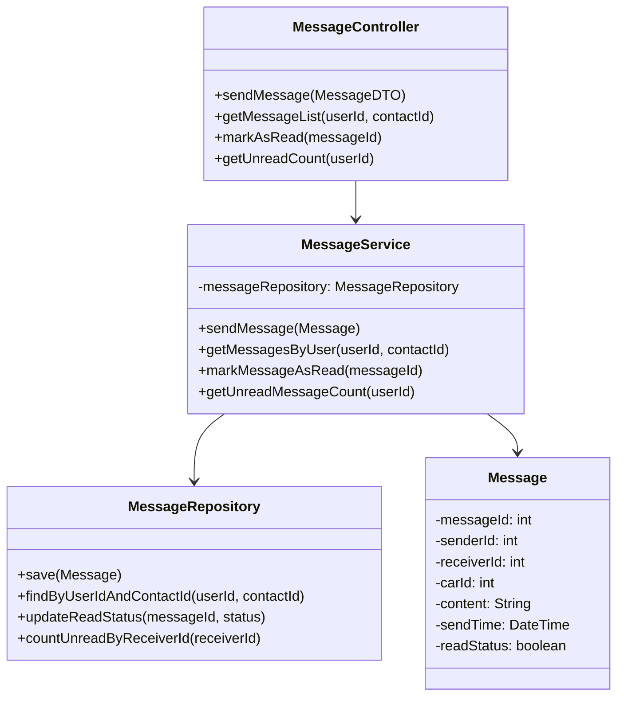
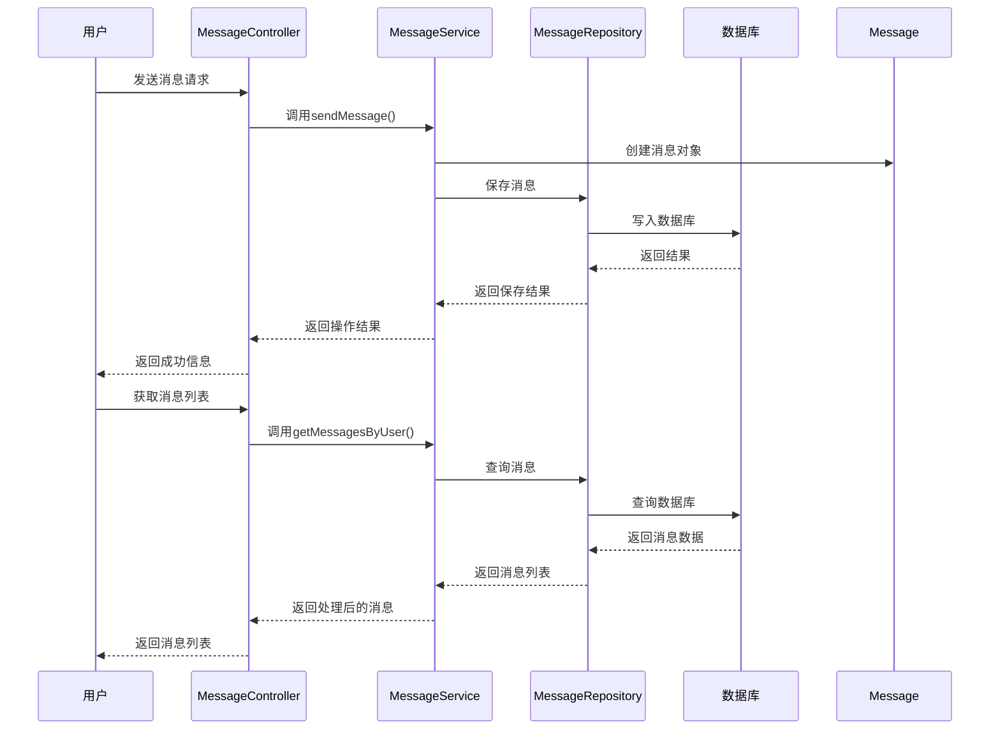
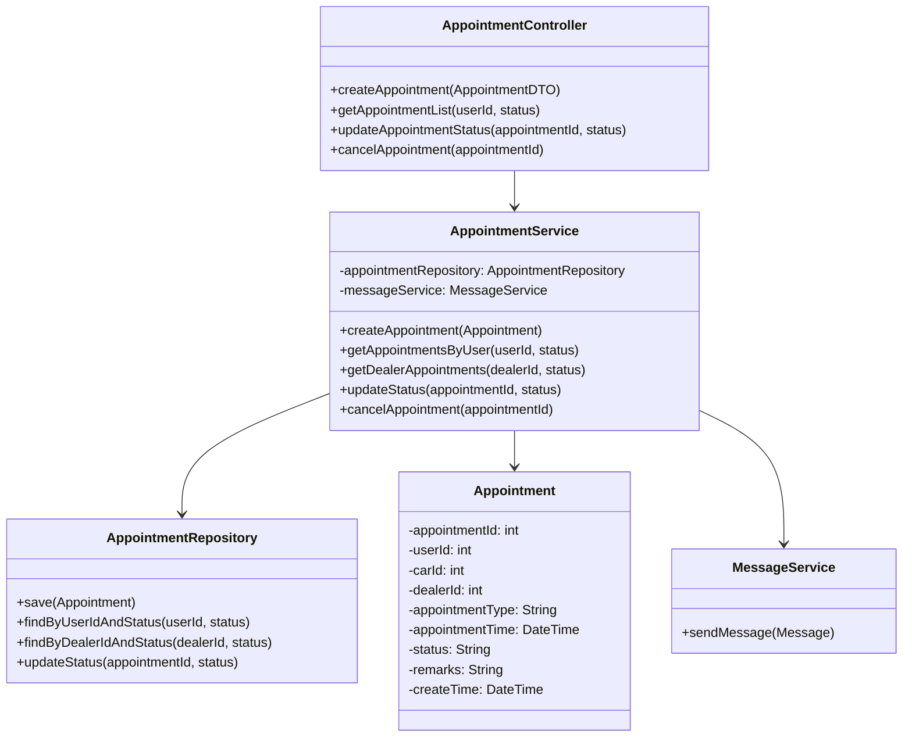
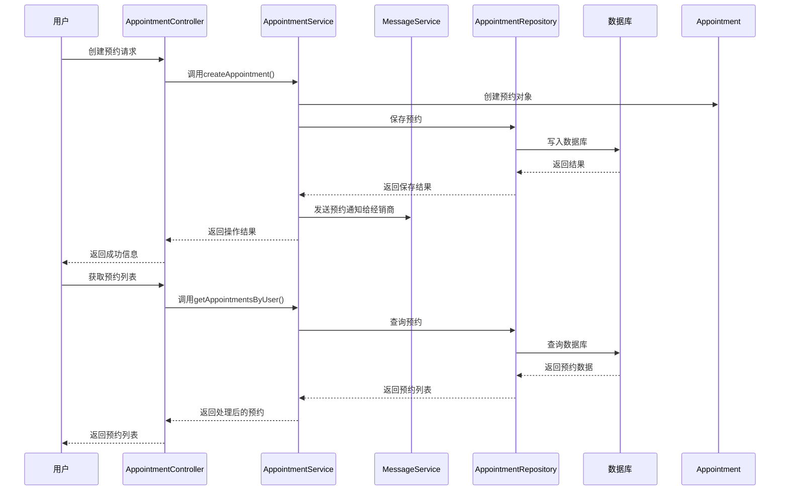
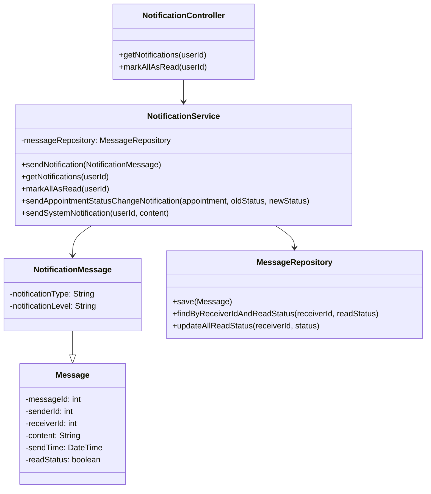
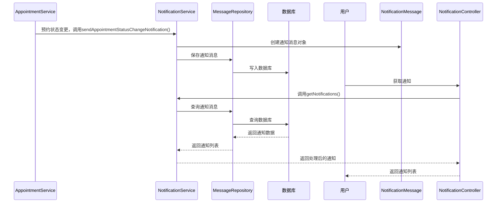

#### 消息交互模块
1、简介

消息交互模块负责用户与经销商之间的沟通以及预约服务功能，是用户和经销商之间建立联系的关键桥梁。该模块提供在线咨询、预约管理和通知提醒等功能，确保用户能够与经销商进行有效沟通并安排试驾或看车服务。

2、功能列表

|序号|功能名称|功能描述|
|---|---|---|
|1|在线咨询|用户与经销商进行即时消息交流|
|2|预约管理|用户预约试驾或看车服务，经销商确认或拒绝预约|
|3|通知提醒|系统自动发送消息通知用户和经销商关于预约状态变更等事件|

##### 在线咨询
1 功能设计描述

在线咨询功能允许用户与经销商通过系统进行消息交流，支持文本消息的发送和接收。

（1）类

- MessageService

负责消息的发送、接收、查询和管理。提供消息的CRUD操作，以及未读消息提醒等功能。

- Message

消息实体类，包含消息ID、发送者ID、接收者ID、相关车辆ID、消息内容、发送时间、读取状态等属性。

- MessageController

处理消息相关的HTTP请求，包括发送消息、获取消息列表、标记消息已读等操作。

- MessageRepository

消息数据访问层，负责与消息表进行交互。

（2）类与类之间关系

（3）文件列表

|名称|类型|存放位置|说明|
|---|---|---|---|
|MessageController.java|控制器|src/main/java/com/smartcar/controller|消息控制器|
|MessageService.java|服务|src/main/java/com/smartcar/service|消息服务|
|MessageServiceImpl.java|服务实现|src/main/java/com/smartcar/service/impl|消息服务实现|
|Message.java|实体类|src/main/java/com/smartcar/entity|消息实体|
|MessageRepository.java|数据访问|src/main/java/com/smartcar/repository|消息数据库访问|
|MessageDTO.java|数据传输对象|src/main/java/com/smartcar/dto|消息数据传输对象|

2 功能实现说明

##### 预约管理
1 功能设计描述

预约管理功能允许用户预约试驾或看车服务，经销商可以确认或拒绝预约。系统会在预约状态变更时自动发送通知。

（1）类

- AppointmentService

负责预约的创建、更新、查询和管理。处理预约状态变更和相关业务逻辑。

- Appointment

预约实体类，包含预约ID、用户ID、车辆ID、经销商ID、预约类型、预约时间、状态、备注等属性。

- AppointmentController

处理预约相关的HTTP请求，包括创建预约、获取预约列表、更新预约状态等操作。

- AppointmentRepository

预约数据访问层，负责与预约表进行交互。

（2）类与类之间关系

（3）文件列表

|名称|类型|存放位置|说明|
|---|---|---|---|
|AppointmentController.java|控制器|src/main/java/com/smartcar/controller|预约控制器|
|AppointmentService.java|服务|src/main/java/com/smartcar/service|预约服务|
|AppointmentServiceImpl.java|服务实现|src/main/java/com/smartcar/service/impl|预约服务实现|
|Appointment.java|实体类|src/main/java/com/smartcar/entity|预约实体|
|AppointmentRepository.java|数据访问|src/main/java/com/smartcar/repository|预约数据库访问|
|AppointmentDTO.java|数据传输对象|src/main/java/com/smartcar/dto|预约数据传输对象|

2 功能实现说明

##### 通知提醒
1 功能设计描述

通知提醒功能负责系统自动发送消息通知用户和经销商关于预约状态变更等事件。

（1）类

- NotificationService

负责生成和发送各类系统通知，包括预约状态变更通知、系统公告等。

- NotificationMessage

继承自Message，添加通知类型、通知级别等属性。

- NotificationController

处理通知相关的HTTP请求，包括获取通知列表、标记通知已读等操作。

（2）类与类之间关系

（3）文件列表

|名称|类型|存放位置|说明|
|---|---|---|---|
|NotificationController.java|控制器|src/main/java/com/smartcar/controller|通知控制器|
|NotificationService.java|服务|src/main/java/com/smartcar/service|通知服务|
|NotificationServiceImpl.java|服务实现|src/main/java/com/smartcar/service/impl|通知服务实现|
|NotificationMessage.java|实体类|src/main/java/com/smartcar/entity|通知消息实体|

2 功能实现说明

