# 智选车 - 汽车推荐购买平台总体模块设计

## 系统架构图

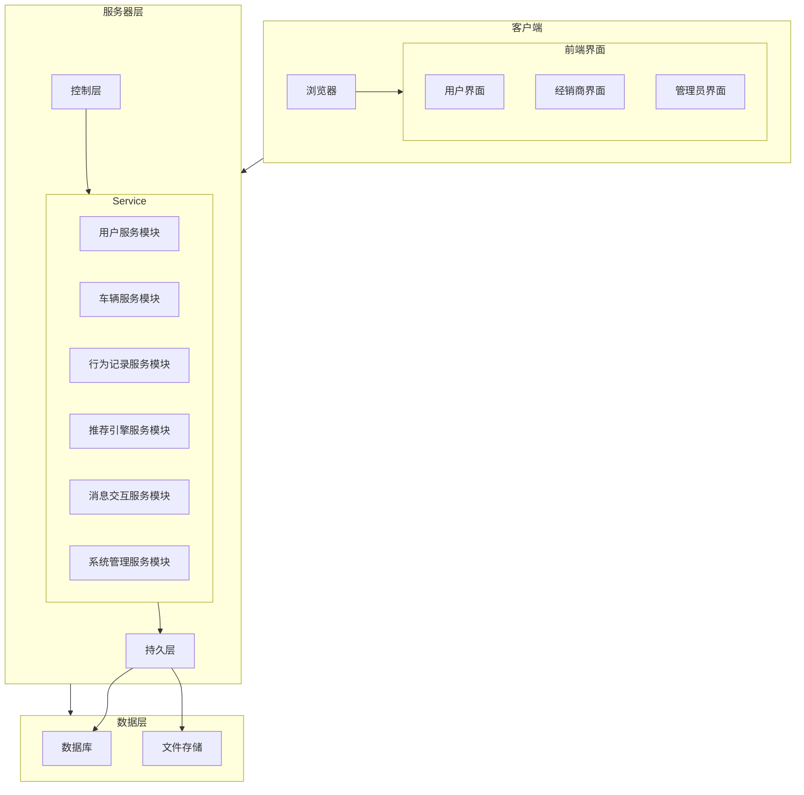

## 核心模块说明

### 1. 用户管理模块

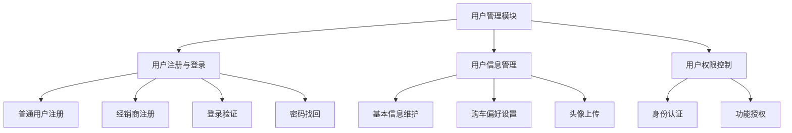

#### 业务流程

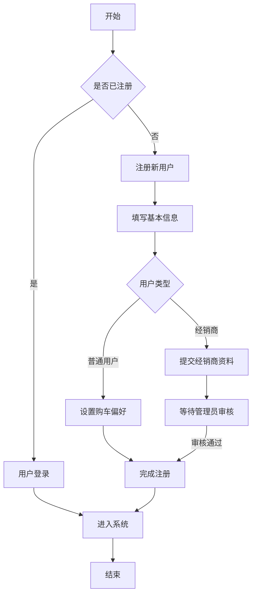

### 2. 车辆管理模块

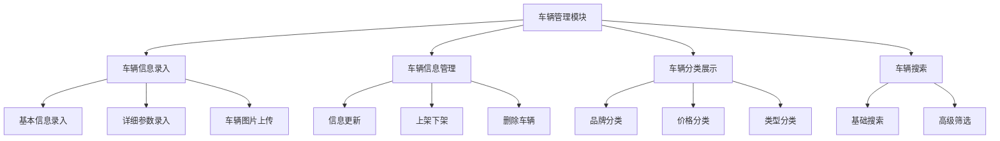

#### 业务流程

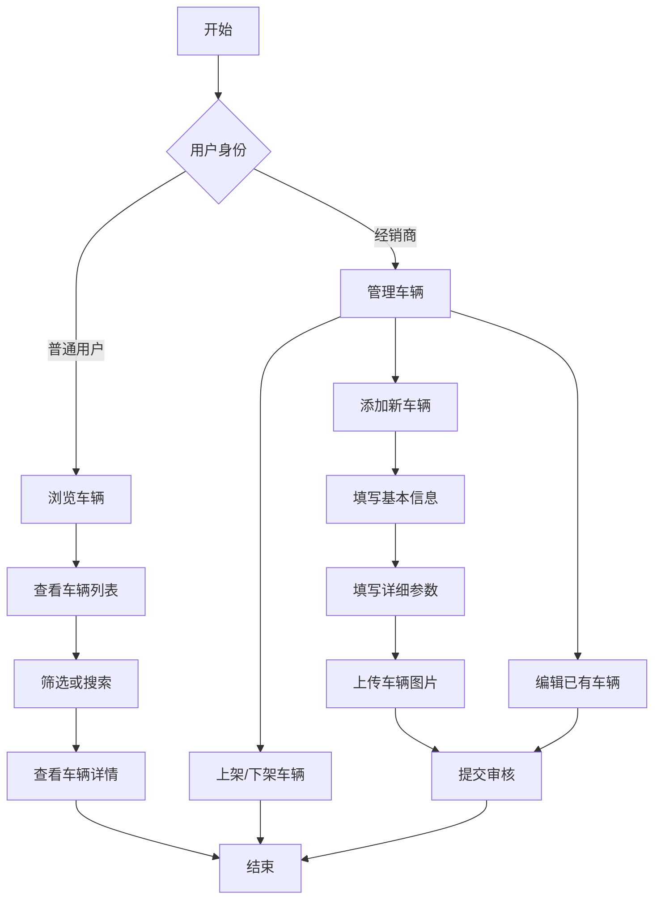

### 3. 行为记录模块

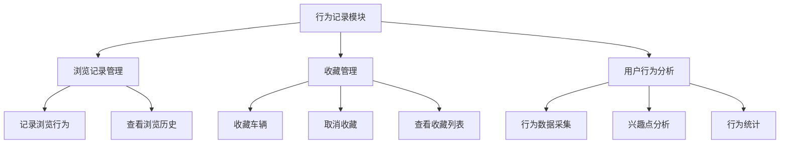

#### 业务流程

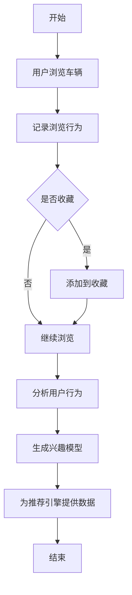

### 4. 推荐引擎模块

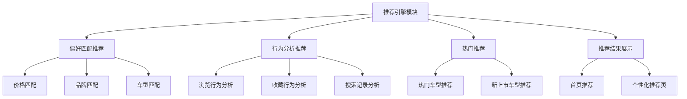

#### 业务流程

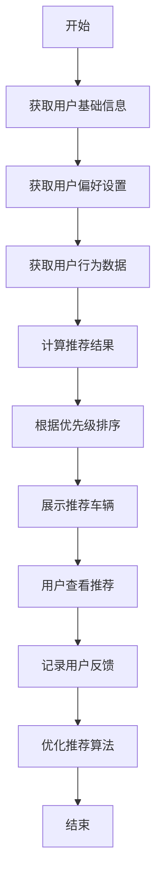

### 5. 消息交互模块

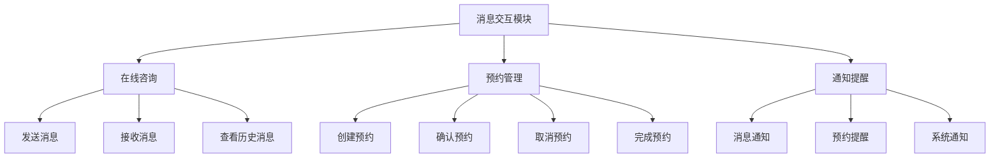

#### 业务流程

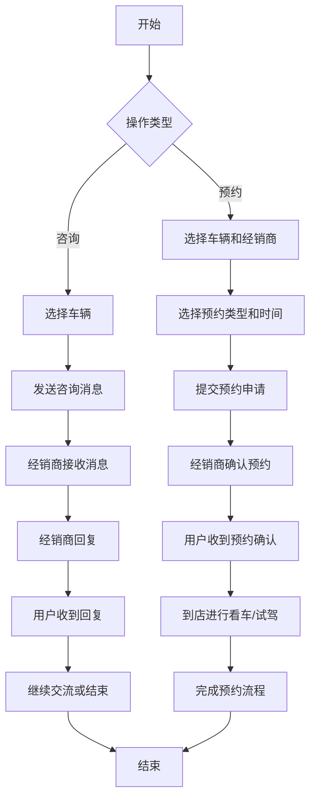

### 6. 系统管理模块

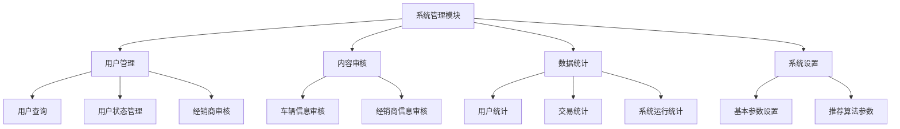

#### 业务流程

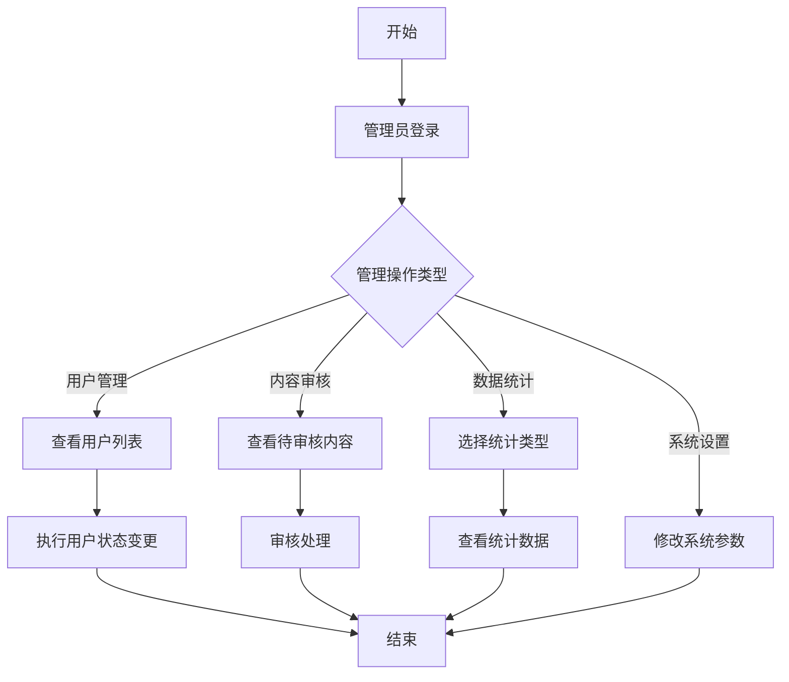

## 模块间交互关系

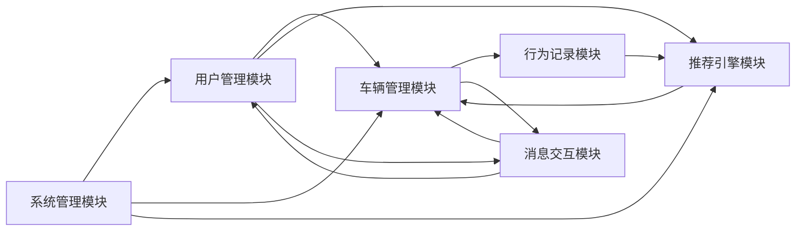

