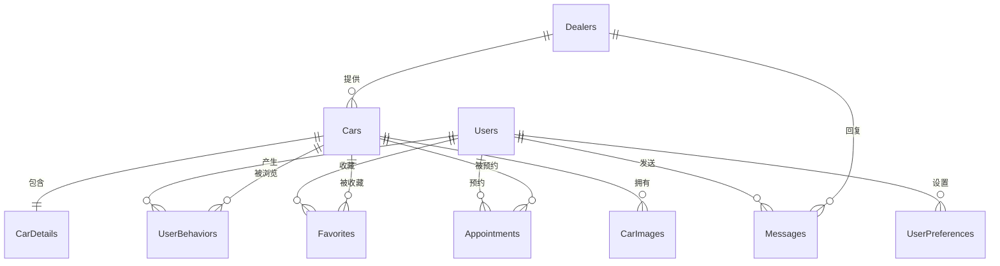

# 智选车 - 数据库设计方案

## 数据库ER图

## 数据表设计

### 1. 用户相关表

#### 1.1 用户表(Users)

| 字段名 | 数据类型 | 主键 | 允许NULL | 默认值 | 说明 |
|--------|----------|------|----------|--------|------|
| user_id | INT | 是 | 否 | 自增 | 用户ID |
| username | VARCHAR(50) | 否 | 否 | - | 用户名，唯一 |
| password | VARCHAR(100) | 否 | 否 | - | 密码 |
| email | VARCHAR(100) | 否 | 否 | - | 邮箱，唯一 |
| phone | VARCHAR(20) | 否 | 是 | - | 电话号码 |
| user_type | ENUM | 否 | 否 | - | 用户类型：普通用户、经销商、管理员 |
| register_time | DATETIME | 否 | 否 | - | 注册时间 |
| last_login_time | DATETIME | 否 | 是 | - | 最后登录时间 |
| status | TINYINT | 否 | 否 | 1 | 状态：1-正常, 0-禁用 |
| avatar | VARCHAR(200) | 否 | 是 | - | 头像URL |

#### 1.2 经销商表(Dealers)

| 字段名 | 数据类型 | 主键 | 允许NULL | 默认值 | 说明 |
|--------|----------|------|----------|--------|------|
| dealer_id | INT | 是 | 否 | 自增 | 经销商ID |
| user_id | INT | 否 | 否 | - | 关联用户ID |
| dealer_name | VARCHAR(100) | 否 | 否 | - | 经销商名称 |
| address | VARCHAR(200) | 否 | 是 | - | 地址 |
| business_license | VARCHAR(100) | 否 | 是 | - | 营业执照号 |
| contact_person | VARCHAR(50) | 否 | 是 | - | 联系人 |
| contact_phone | VARCHAR(20) | 否 | 是 | - | 联系电话 |
| status | TINYINT | 否 | 否 | 0 | 状态：0-待审核, 1-已审核, 2-拒绝 |
| description | TEXT | 否 | 是 | - | 描述 |

### 2. 车辆相关表

#### 2.1 车辆表(Cars)

| 字段名 | 数据类型 | 主键 | 允许NULL | 默认值 | 说明 |
|--------|----------|------|----------|--------|------|
| car_id | INT | 是 | 否 | 自增 | 车辆ID |
| dealer_id | INT | 否 | 否 | - | 关联经销商ID |
| brand | VARCHAR(50) | 否 | 否 | - | 品牌 |
| model | VARCHAR(100) | 否 | 否 | - | 型号 |
| year | YEAR | 否 | 否 | - | 年款 |
| price | DECIMAL(12,2) | 否 | 否 | - | 价格 |
| category | VARCHAR(50) | 否 | 否 | - | 类别：轿车/SUV/MPV等 |
| status | TINYINT | 否 | 否 | 1 | 状态：1-在售, 0-下架 |
| create_time | DATETIME | 否 | 否 | - | 创建时间 |
| update_time | DATETIME | 否 | 是 | - | 更新时间 |

#### 2.2 车辆详情表(CarDetails)

| 字段名 | 数据类型 | 主键 | 允许NULL | 默认值 | 说明 |
|--------|----------|------|----------|--------|------|
| detail_id | INT | 是 | 否 | 自增 | 详情ID |
| car_id | INT | 否 | 否 | - | 关联车辆ID |
| engine | VARCHAR(100) | 否 | 是 | - | 发动机 |
| transmission | VARCHAR(50) | 否 | 是 | - | 变速箱 |
| fuel_type | VARCHAR(50) | 否 | 是 | - | 燃料类型 |
| fuel_consumption | DECIMAL(5,2) | 否 | 是 | - | 油耗(L/100km) |
| seats | INT | 否 | 是 | - | 座位数 |
| color | VARCHAR(200) | 否 | 是 | - | 可选颜色，逗号分隔 |
| body_size | VARCHAR(100) | 否 | 是 | - | 车身尺寸 |
| wheelbase | DECIMAL(6,1) | 否 | 是 | - | 轴距(mm) |
| features | TEXT | 否 | 是 | - | 配置特点 |
| warranty | VARCHAR(100) | 否 | 是 | - | 保修信息 |

#### 2.3 车辆图片表(CarImages)

| 字段名 | 数据类型 | 主键 | 允许NULL | 默认值 | 说明 |
|--------|----------|------|----------|--------|------|
| image_id | INT | 是 | 否 | 自增 | 图片ID |
| car_id | INT | 否 | 否 | - | 关联车辆ID |
| image_type | ENUM | 否 | 否 | - | 图片类型：缩略图、完整图1-5 |
| image_url | VARCHAR(200) | 否 | 否 | - | 图片URL |
| upload_time | DATETIME | 否 | 否 | - | 上传时间 |

### 3. 用户行为与偏好相关表

#### 3.1 用户偏好表(UserPreferences)

| 字段名 | 数据类型 | 主键 | 允许NULL | 默认值 | 说明 |
|--------|----------|------|----------|--------|------|
| preference_id | INT | 是 | 否 | 自增 | 偏好ID |
| user_id | INT | 否 | 否 | - | 关联用户ID |
| price_min | DECIMAL(12,2) | 否 | 是 | - | 最低价格 |
| price_max | DECIMAL(12,2) | 否 | 是 | - | 最高价格 |
| preferred_brands | VARCHAR(200) | 否 | 是 | - | 偏好品牌，逗号分隔 |
| preferred_categories | VARCHAR(200) | 否 | 是 | - | 偏好车型，逗号分隔 |
| other_preferences | TEXT | 否 | 是 | - | 其他偏好 |
| update_time | DATETIME | 否 | 否 | - | 更新时间 |

#### 3.2 用户行为记录表(UserBehaviors)

| 字段名 | 数据类型 | 主键 | 允许NULL | 默认值 | 说明 |
|--------|----------|------|----------|--------|------|
| behavior_id | INT | 是 | 否 | 自增 | 行为ID |
| user_id | INT | 否 | 否 | - | 关联用户ID |
| car_id | INT | 否 | 否 | - | 关联车辆ID |
| behavior_type | ENUM | 否 | 否 | - | 行为类型：浏览、搜索、咨询 |
| behavior_time | DATETIME | 否 | 否 | - | 行为时间 |
| duration | INT | 否 | 是 | - | 浏览时长(秒) |
| search_keywords | VARCHAR(200) | 否 | 是 | - | 搜索关键词 |

#### 3.3 收藏表(Favorites)

| 字段名 | 数据类型 | 主键 | 允许NULL | 默认值 | 说明 |
|--------|----------|------|----------|--------|------|
| favorite_id | INT | 是 | 否 | 自增 | 收藏ID |
| user_id | INT | 否 | 否 | - | 关联用户ID |
| car_id | INT | 否 | 否 | - | 关联车辆ID |
| create_time | DATETIME | 否 | 否 | - | 收藏时间 |

### 4. 交互功能相关表

#### 4.1 消息表(Messages)

| 字段名 | 数据类型 | 主键 | 允许NULL | 默认值 | 说明 |
|--------|----------|------|----------|--------|------|
| message_id | INT | 是 | 否 | 自增 | 消息ID |
| sender_id | INT | 否 | 否 | - | 发送者ID |
| receiver_id | INT | 否 | 否 | - | 接收者ID |
| car_id | INT | 否 | 是 | - | 相关车辆ID |
| content | TEXT | 否 | 否 | - | 消息内容 |
| send_time | DATETIME | 否 | 否 | - | 发送时间 |
| read_status | TINYINT | 否 | 否 | 0 | 读取状态：0-未读, 1-已读 |

#### 4.2 预约表(Appointments)

| 字段名 | 数据类型 | 主键 | 允许NULL | 默认值 | 说明 |
|--------|----------|------|----------|--------|------|
| appointment_id | INT | 是 | 否 | 自增 | 预约ID |
| user_id | INT | 否 | 否 | - | 关联用户ID |
| car_id | INT | 否 | 否 | - | 关联车辆ID |
| dealer_id | INT | 否 | 否 | - | 关联经销商ID |
| appointment_type | ENUM | 否 | 否 | - | 预约类型：看车、试驾 |
| appointment_time | DATETIME | 否 | 否 | - | 预约时间 |
| status | ENUM | 否 | 否 | 待确认 | 状态：待确认、已确认、已完成、已取消 |
| remarks | TEXT | 否 | 是 | - | 备注 |
| create_time | DATETIME | 否 | 否 | - | 创建时间 |

## 数据库说明

1. 用户管理：
   - Users表存储所有类型用户的基本信息
   - Dealers表存储经销商的特殊信息

2. 车辆管理：
   - Cars表存储车辆基本信息
   - CarDetails表存储车辆详细参数
   - CarImages表存储车辆的多张图片，支持缩略图和多角度完整图展示

3. 用户行为与偏好：
   - UserPreferences表存储用户设置的购车偏好
   - UserBehaviors表记录用户浏览、搜索等行为
   - Favorites表记录用户收藏的车辆

4. 交互功能：
   - Messages表存储用户与经销商的消息
   - Appointments表管理看车和试驾预约

