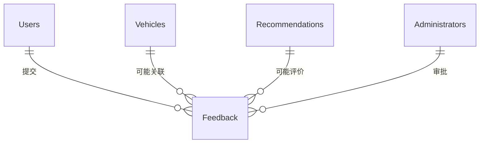
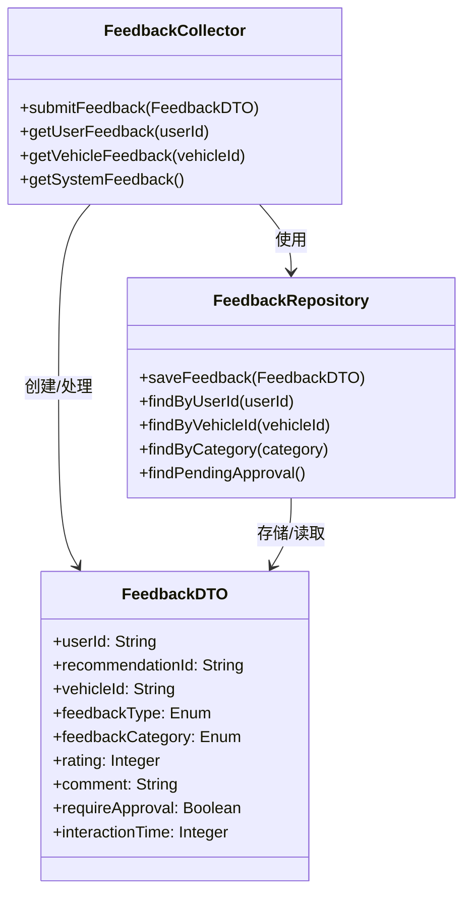
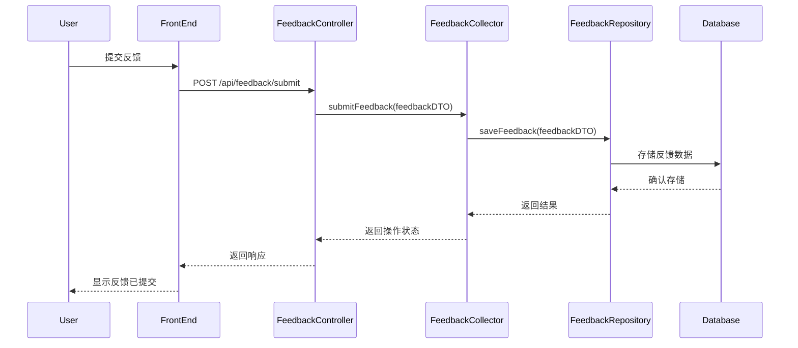
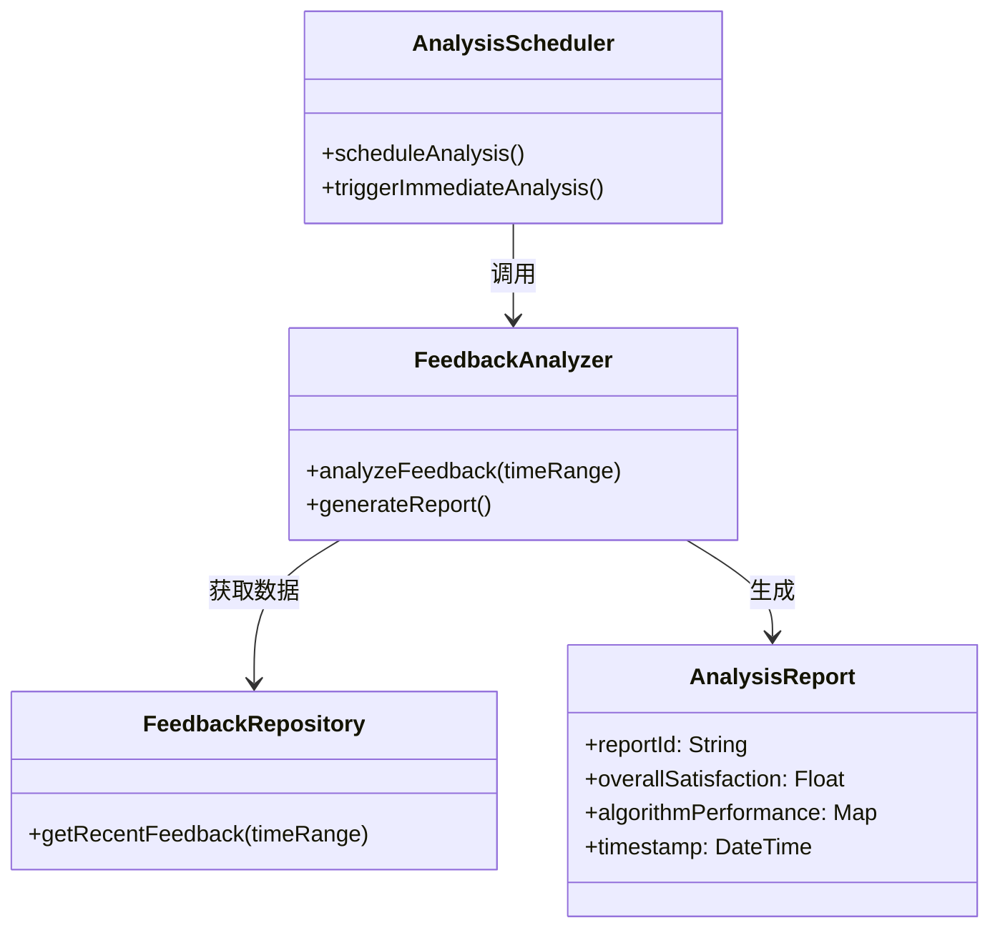
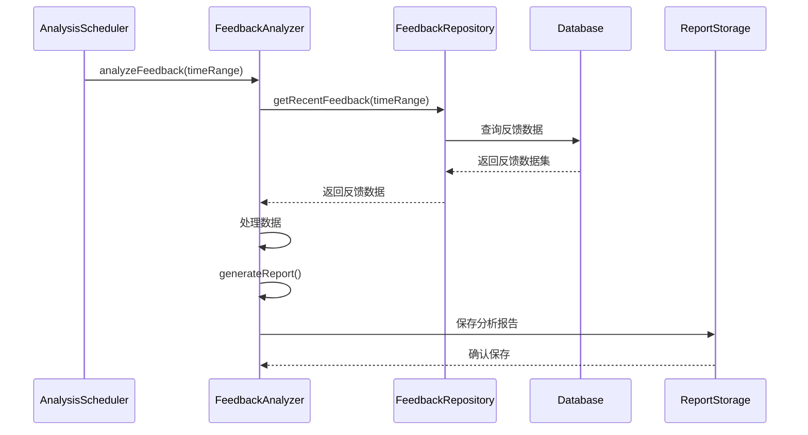
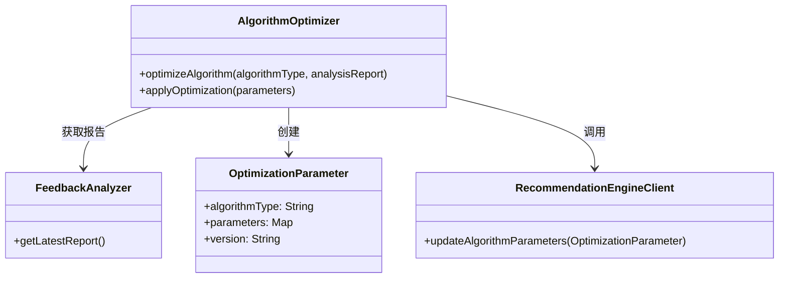
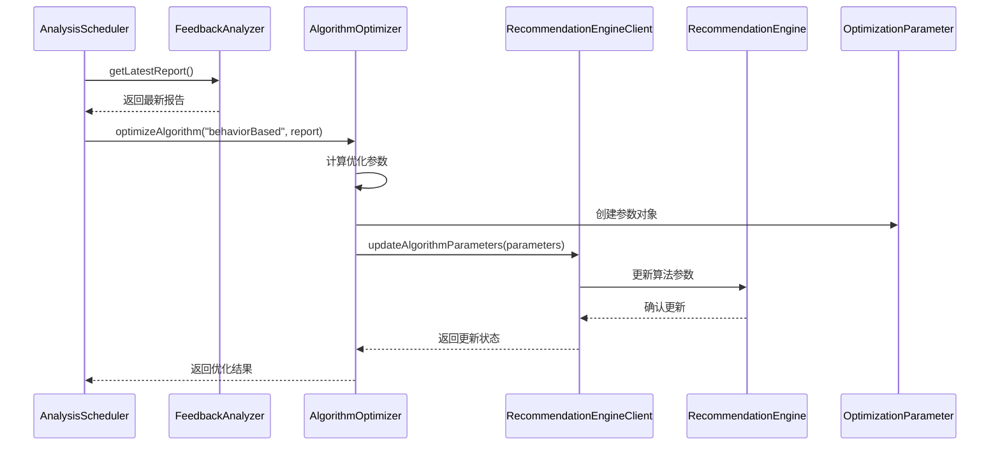
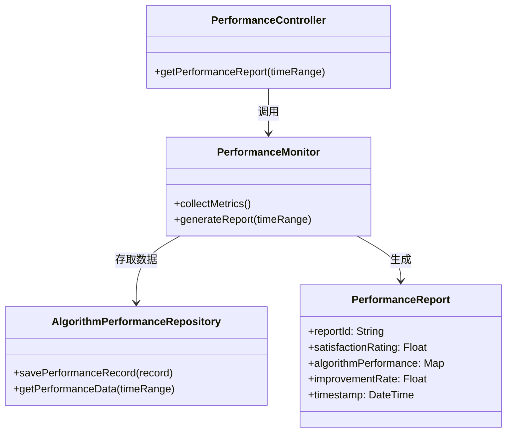
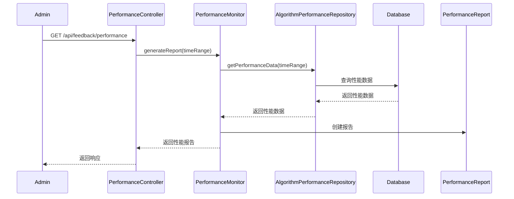

#### 反馈优化模块
1、简介

反馈优化模块主要负责收集用户对推荐结果的反馈信息，分析这些反馈数据，并根据分析结果优化推荐算法，提高推荐的准确性和用户满意度。

2、功能列表

|序号|功能名称|功能描述|
|---|-------|-------|
|1|反馈收集|收集用户对推荐车辆的评价（点赞、收藏、评论、点击等）|
|2|反馈分析|分析用户反馈数据，识别模式和趋势，计算各推荐算法的准确性|
|3|算法优化|基于反馈数据调整推荐算法参数，对不同类型用户个性化算法权重|
|4|性能监控|监控推荐系统性能指标，追踪用户满意度变化|

3、数据库设计

反馈优化模块采用单表设计，统一存储所有类型的用户反馈数据。

（1）统一反馈表（Feedback）

| 字段名 | 类型 | 约束 | 说明 |
|--------|------|------|------|
| id | VARCHAR(32) | 主键 | 反馈ID |
| userId | VARCHAR(32) | 外键 | 用户ID，关联用户表 |
| vehicleId | VARCHAR(32) | 外键，可空 | 车辆ID，关联车辆表，针对车辆的反馈不为空 |
| recommendationId | VARCHAR(32) | 可空 | 推荐结果ID，如果是对推荐结果的反馈则不为空 |
| feedbackType | VARCHAR(20) | 非空 | 反馈类型：LIKE, DISLIKE, COMMENT, REPORT, SUGGESTION, QUESTION |
| feedbackCategory | VARCHAR(20) | 非空 | 反馈类别：ALGORITHM(算法相关), CONTENT(内容相关), SYSTEM(系统相关), OTHER(其他) |
| rating | INT | 可空 | 评分（1-5分），针对算法反馈 |
| comment | TEXT | 可空 | 反馈内容或评论 |
| status | VARCHAR(20) | 非空 | 状态：PENDING(待处理), APPROVED(已批准), REJECTED(已拒绝), PROCESSED(已处理) |
| requireApproval | BOOLEAN | 非空，默认false | 是否需要管理员审批 |
| approvalComment | TEXT | 可空 | 管理员审批意见 |
| approvedBy | VARCHAR(32) | 可空 | 审批人ID |
| approvalTime | DATETIME | 可空 | 审批时间 |
| interactionTime | INT | 可空 | 互动时长（秒），针对算法反馈 |
| processResult | TEXT | 可空 | 处理结果，包含算法调整信息或其他处理结果 |
| createTime | DATETIME | 非空 | 创建时间 |
| updateTime | DATETIME | 非空 | 更新时间 |

（2）关系图

（3）反馈类型

- 针对车辆的反馈：需要填写vehicleId
- 针对推荐结果的反馈：需要填写recommendationId，可能不需要vehicleId
- 针对系统功能的反馈：不需要vehicleId和recommendationId
- 通用反馈：不需要vehicleId和recommendationId

（4）处理流程

- 算法类型反馈流程：PENDING → PROCESSED（自动处理）
- 需要审批的反馈流程：PENDING → APPROVED/REJECTED → PROCESSED（人工介入）

##### 反馈收集
1 功能设计描述

反馈收集功能负责捕获和存储用户对推荐结果的各种反馈，包括显性反馈（如评分、评论）和隐性反馈（如点击、浏览时间）。

（1）类

- FeedbackCollector
  
  负责收集和处理用户反馈数据，提供接口供前端调用。

- FeedbackRepository
  
  负责将反馈数据持久化到数据库，并提供查询接口。

- FeedbackDTO
  
  反馈数据传输对象，用于封装反馈信息。

（2）类与类之间关系

（3）文件列表

|名称|类型|存放位置|说明|
|---|---|-------|---|
|FeedbackCollector.java|类|src/main/java/com/smartcar/feedback/service|反馈收集服务|
|FeedbackRepository.java|接口|src/main/java/com/smartcar/feedback/repository|反馈数据访问接口|
|FeedbackDTO.java|类|src/main/java/com/smartcar/feedback/dto|反馈数据传输对象|
|FeedbackController.java|类|src/main/java/com/smartcar/feedback/controller|反馈接口控制器|

2 功能实现说明

##### 反馈分析
1 功能设计描述

反馈分析功能负责处理和分析已收集的反馈数据，生成洞察和报告，为算法优化提供依据。

（1）类

- FeedbackAnalyzer
  
  负责分析反馈数据，识别模式和趋势。

- AnalysisReport
  
  封装分析结果，包括满意度指标、算法表现等信息。

- AnalysisScheduler
  
  调度分析任务，定期触发分析流程。

（2）类与类之间关系

（3）文件列表

|名称|类型|存放位置|说明|
|---|---|-------|---|
|FeedbackAnalyzer.java|类|src/main/java/com/smartcar/feedback/analysis|反馈分析服务|
|AnalysisReport.java|类|src/main/java/com/smartcar/feedback/dto|分析报告数据对象|
|AnalysisScheduler.java|类|src/main/java/com/smartcar/feedback/scheduler|分析任务调度器|

2 功能实现说明

##### 算法优化
1 功能设计描述

算法优化功能根据反馈分析结果调整推荐算法参数，提高推荐精度。

（1）类

- AlgorithmOptimizer
  
  负责基于分析结果优化算法参数。

- OptimizationParameter
  
  封装优化后的算法参数。

- RecommendationEngineClient
  
  与推荐引擎模块通信的客户端。

（2）类与类之间关系

（3）文件列表

|名称|类型|存放位置|说明|
|---|---|-------|---|
|AlgorithmOptimizer.java|类|src/main/java/com/smartcar/feedback/optimization|算法优化服务|
|OptimizationParameter.java|类|src/main/java/com/smartcar/feedback/dto|优化参数对象|
|RecommendationEngineClient.java|接口|src/main/java/com/smartcar/feedback/client|推荐引擎客户端|

2 功能实现说明

##### 性能监控
1 功能设计描述

性能监控功能跟踪和评估推荐系统性能，生成报告。

（1）类

- PerformanceMonitor
  
  负责监控推荐系统性能指标。

- PerformanceReport
  
  封装性能报告数据。

- PerformanceController
  
  提供API接口查询性能数据。

（2）类与类之间关系

（3）文件列表

|名称|类型|存放位置|说明|
|---|---|-------|---|
|PerformanceMonitor.java|类|src/main/java/com/smartcar/feedback/monitor|性能监控服务|
|PerformanceReport.java|类|src/main/java/com/smartcar/feedback/dto|性能报告对象|
|PerformanceController.java|类|src/main/java/com/smartcar/feedback/controller|性能监控接口控制器|
|AlgorithmPerformanceRepository.java|接口|src/main/java/com/smartcar/feedback/repository|性能数据访问接口|

2 功能实现说明

