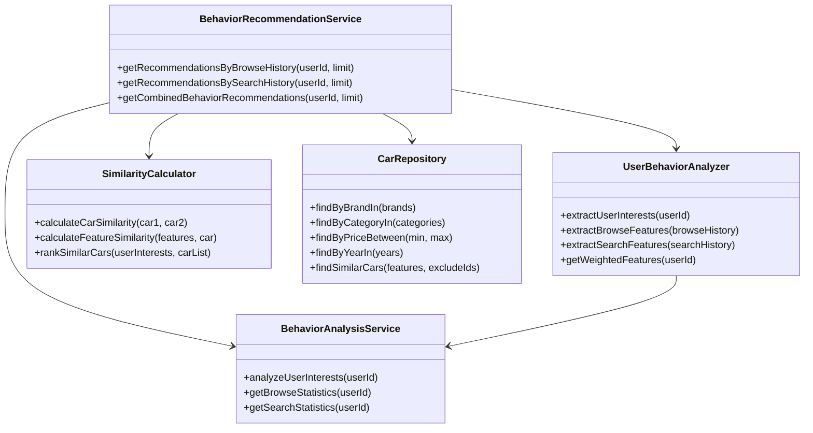
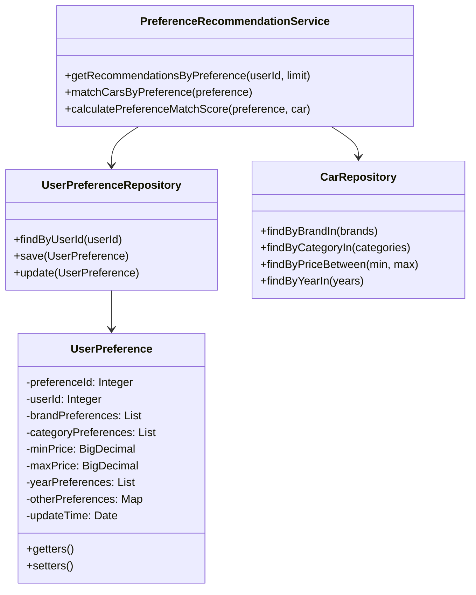
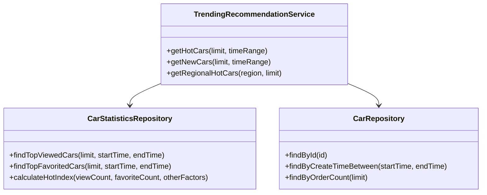
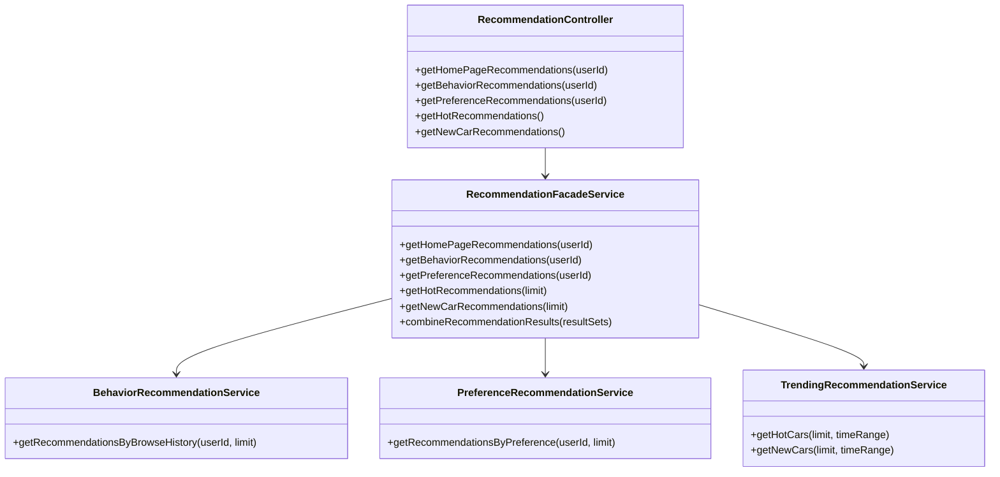

## 推荐引擎模块

### 1. 简介

推荐引擎模块是系统的智能核心，负责基于用户行为数据、偏好设置以及车辆特征，为用户提供个性化的车辆推荐。该模块通过分析用户兴趣，提高用户找到满意车辆的效率，增强用户体验。

### 2. 功能列表

| 序号 | 功能名称 | 功能描述 |
|------|----------|----------|
| 1    | 基于行为的推荐 | 根据用户的浏览、搜索等行为记录推荐相似车辆 |
| 2    | 基于偏好的推荐 | 根据用户设置的购车偏好推荐符合条件的车辆 |
| 3    | 热门趋势推荐 | 推荐系统内热门或新上架的车辆 |
| 4    | 推荐结果展示 | 在首页和各功能页面展示推荐结果 |

### 3. 子功能设计

#### 3.1 基于行为的推荐

##### 1) 功能设计描述

基于行为的推荐子功能通过分析用户的浏览历史、搜索记录等行为数据，找出用户可能感兴趣的车辆进行推荐。

###### (1) 类

- **BehaviorRecommendationService**
  
  实现基于用户行为的推荐算法的服务类。

- **UserBehaviorAnalyzer**
  
  分析用户行为数据，提取用户兴趣特征的工具类。

- **SimilarityCalculator**
  
  计算车辆之间相似度的工具类。

###### (2) 类与类之间关系



###### (3) 文件列表

| 名称 | 类型 | 存放位置 | 说明 |
|------|------|----------|------|
| BehaviorRecommendationService.java | 接口 | service/recommendation | 基于行为的推荐服务接口 |
| BehaviorRecommendationServiceImpl.java | 类 | service/recommendation/impl | 基于行为的推荐服务实现 |
| UserBehaviorAnalyzer.java | 类 | service/analysis | 用户行为分析器 |
| SimilarityCalculator.java | 类 | service/algorithm | 相似度计算器 |
| RecommendationFeature.java | 类 | model | 推荐特征模型 |
| CarSimilarity.java | 类 | model | 车辆相似度模型 |

##### 2) 功能实现说明

###### 基于浏览历史的推荐流程

```mermaid
sequenceDiagram
    参与者 RecommendationController
    参与者 BehaviorRecommendationService
    参与者 UserBehaviorAnalyzer
    参与者 BehaviorAnalysisService
    参与者 SimilarityCalculator
    参与者 CarRepository
    参与者 Database
    
    RecommendationController->>BehaviorRecommendationService: 请求基于浏览历史的推荐
    BehaviorRecommendationService->>BehaviorAnalysisService: 获取用户浏览记录
    BehaviorAnalysisService->>Database: 查询浏览记录
    Database-->>BehaviorAnalysisService: 返回浏览记录
    BehaviorAnalysisService-->>BehaviorRecommendationService: 返回浏览记录数据
    
    BehaviorRecommendationService->>UserBehaviorAnalyzer: 提取用户浏览兴趣特征
    UserBehaviorAnalyzer->>UserBehaviorAnalyzer: 分析品牌、类别、价格区间等特征
    UserBehaviorAnalyzer-->>BehaviorRecommendationService: 返回用户兴趣特征
    
    BehaviorRecommendationService->>CarRepository: 查询符合特征的车辆
    CarRepository->>Database: 查询数据库
    Database-->>CarRepository: 返回候选车辆
    CarRepository-->>BehaviorRecommendationService: 返回候选车辆列表
    
    BehaviorRecommendationService->>SimilarityCalculator: 计算候选车辆与用户兴趣的相似度
    SimilarityCalculator->>SimilarityCalculator: 计算相似度并排序
    SimilarityCalculator-->>BehaviorRecommendationService: 返回排序后的车辆列表
    
    BehaviorRecommendationService-->>RecommendationController: 返回推荐车辆列表
```

#### 3.2 基于偏好的推荐

##### 1) 功能设计描述

基于偏好的推荐子功能根据用户在系统中设置的购车偏好（如预算范围、车型偏好等）进行精准匹配推荐。

###### (1) 类

- **PreferenceRecommendationService**
  
  实现基于用户偏好的推荐算法的服务类。

- **UserPreferenceRepository**
  
  负责用户偏好数据的持久化操作。

- **UserPreference**
  
  用户偏好实体类，对应数据库UserPreferences表。

###### (2) 类与类之间关系



###### (3) 文件列表

| 名称 | 类型 | 存放位置 | 说明 |
|------|------|----------|------|
| PreferenceRecommendationService.java | 接口 | service/recommendation | 基于偏好的推荐服务接口 |
| PreferenceRecommendationServiceImpl.java | 类 | service/recommendation/impl | 基于偏好的推荐服务实现 |
| UserPreferenceRepository.java | 接口 | repository | 用户偏好数据访问接口 |
| UserPreference.java | 类 | entity | 用户偏好实体类 |
| PreferenceMatchResult.java | 类 | model | 偏好匹配结果模型 |

##### 2) 功能实现说明

###### 偏好匹配推荐流程

```mermaid
sequenceDiagram
    参与者 RecommendationController
    参与者 PreferenceRecommendationService
    参与者 UserPreferenceRepository
    参与者 CarRepository
    参与者 Database
    
    RecommendationController->>PreferenceRecommendationService: 请求基于偏好的推荐
    PreferenceRecommendationService->>UserPreferenceRepository: 获取用户偏好设置
    UserPreferenceRepository->>Database: 查询数据库
    Database-->>UserPreferenceRepository: 返回偏好数据
    UserPreferenceRepository-->>PreferenceRecommendationService: 返回用户偏好
    
    PreferenceRecommendationService->>CarRepository: 根据偏好查询符合条件的车辆
    CarRepository->>Database: 查询数据库
    Database-->>CarRepository: 返回符合条件的车辆
    CarRepository-->>PreferenceRecommendationService: 返回车辆列表
    
    PreferenceRecommendationService->>PreferenceRecommendationService: 计算每辆车与偏好的匹配度
    PreferenceRecommendationService->>PreferenceRecommendationService: 根据匹配度排序
    
    PreferenceRecommendationService-->>RecommendationController: 返回推荐车辆列表
```

#### 3.3 热门趋势推荐

##### 1) 功能设计描述

热门趋势推荐子功能负责推荐系统中当前热门车辆和新上架车辆，帮助用户了解市场动态和新车信息。

###### (1) 类

- **TrendingRecommendationService**
  
  实现热门趋势推荐的服务类。

- **CarStatisticsRepository**
  
  负责车辆统计数据的持久化操作。

###### (2) 类与类之间关系



###### (3) 文件列表

| 名称 | 类型 | 存放位置 | 说明 |
|------|------|----------|------|
| TrendingRecommendationService.java | 接口 | service/recommendation | 热门趋势推荐服务接口 |
| TrendingRecommendationServiceImpl.java | 类 | service/recommendation/impl | 热门趋势推荐服务实现 |
| CarStatisticsRepository.java | 接口 | repository | 车辆统计数据访问接口 |
| TimeRange.java | 类 | model | 时间范围模型 |
| PopularityCriteria.java | 枚举 | model | 热门度标准枚举 |

##### 2) 功能实现说明

###### 热门车辆推荐流程

```mermaid
sequenceDiagram
    参与者 RecommendationController
    参与者 TrendingRecommendationService
    参与者 CarStatisticsRepository
    参与者 Database
    
    RecommendationController->>TrendingRecommendationService: 请求热门车辆推荐
    TrendingRecommendationService->>TrendingRecommendationService: 确定时间范围和热门标准
    TrendingRecommendationService->>CarStatisticsRepository: 查询热门车辆
    CarStatisticsRepository->>Database: 查询数据库
    Database-->>CarStatisticsRepository: 返回热门车辆数据
    CarStatisticsRepository-->>TrendingRecommendationService: 返回热门车辆列表
    
    TrendingRecommendationService->>TrendingRecommendationService: 根据用户所在地区调整排序
    
    TrendingRecommendationService-->>RecommendationController: 返回热门推荐车辆列表
```

#### 3.4 推荐结果展示

##### 1) 功能设计描述

推荐结果展示子功能负责在系统不同场景下展示个性化推荐结果，如首页推荐、基于行为的推荐、基于偏好的推荐等。

###### (1) 类

- **RecommendationController**
  
  处理推荐相关HTTP请求的控制器类。

- **RecommendationFacadeService**
  
  整合各种推荐策略的门面服务类。

###### (2) 类与类之间关系



###### (3) 文件列表

| 名称 | 类型 | 存放位置 | 说明 |
|------|------|----------|------|
| RecommendationController.java | 类 | controller | 推荐控制器 |
| RecommendationFacadeService.java | 接口 | service | 推荐门面服务接口 |
| RecommendationFacadeServiceImpl.java | 类 | service/impl | 推荐门面服务实现 |
| RecommendationScenario.java | 枚举 | model | 推荐场景枚举 |
| RecommendationDTO.java | 类 | dto | 推荐结果数据传输对象 |
| RecommendationResponse.java | 类 | dto | 推荐响应数据传输对象 |

##### 2) 功能实现说明

###### 首页推荐展示流程

```mermaid
sequenceDiagram
    参与者 Client
    参与者 RecommendationController
    参与者 RecommendationFacadeService
    参与者 BehaviorRecommendationService
    参与者 PreferenceRecommendationService
    参与者 TrendingRecommendationService
    
    Client->>RecommendationController: 请求首页推荐
    RecommendationController->>RecommendationFacadeService: 调用getHomePageRecommendations(userId)
    
    alt 已登录用户
        RecommendationFacadeService->>BehaviorRecommendationService: 获取基于行为的推荐
        BehaviorRecommendationService-->>RecommendationFacadeService: 返回行为推荐结果
        
        RecommendationFacadeService->>PreferenceRecommendationService: 获取基于偏好的推荐
        PreferenceRecommendationService-->>RecommendationFacadeService: 返回偏好推荐结果
        
        RecommendationFacadeService->>TrendingRecommendationService: 获取热门推荐
        TrendingRecommendationService-->>RecommendationFacadeService: 返回热门推荐结果
        
        RecommendationFacadeService->>RecommendationFacadeService: 组合多种推荐结果
    else 未登录用户
        RecommendationFacadeService->>TrendingRecommendationService: 获取热门推荐
        TrendingRecommendationService-->>RecommendationFacadeService: 返回热门推荐结果
    end
    
    RecommendationFacadeService-->>RecommendationController: 返回最终推荐结果
    RecommendationController-->>Client: 返回推荐车辆响应
```
