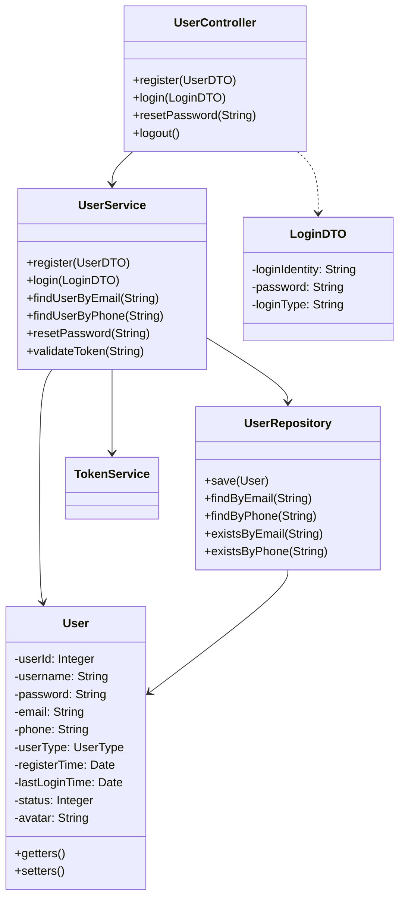
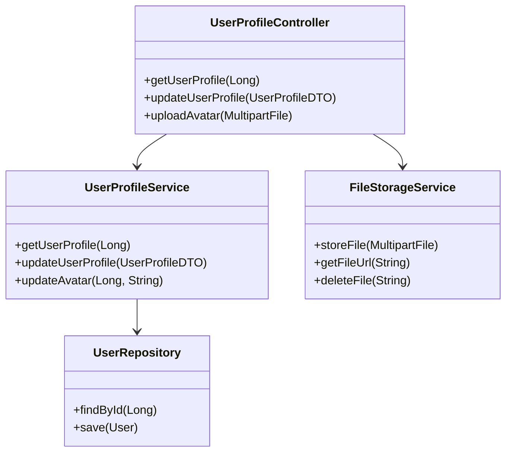
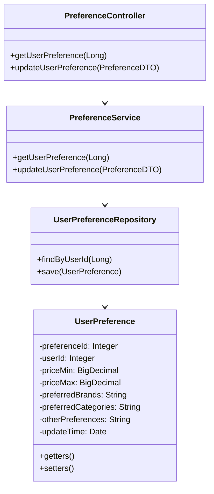
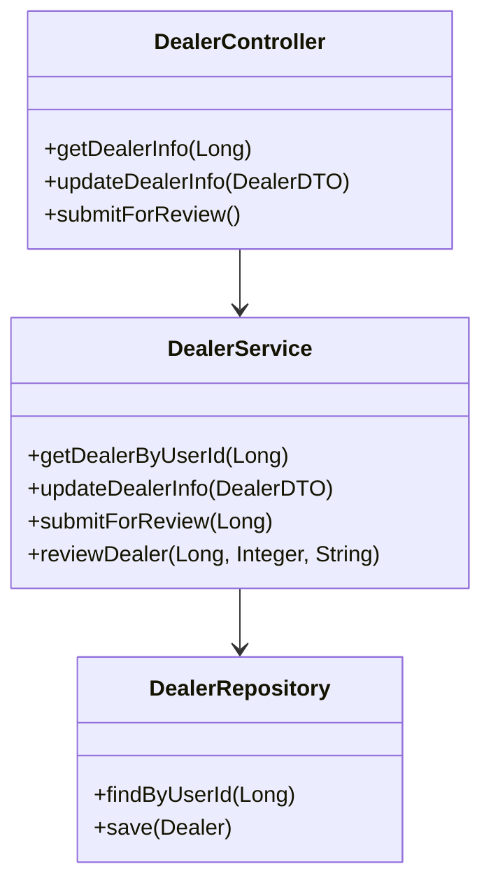

## 用户模块

### 1. 简介

用户模块负责系统中所有用户的管理，包括普通用户、经销商用户和管理员的注册、登录、信息管理、权限控制以及用户偏好设置等功能，是系统的基础模块。

### 2. 功能列表

| 序号 | 功能名称 | 功能描述 |
|------|----------|----------|
| 1    | 用户注册与登录 | 支持普通用户和经销商用户注册、登录及密码找回 |
| 2    | 用户信息管理 | 查看和修改用户基本信息，包括头像上传等 |
| 3    | 购车偏好设置 | 设置用户购车偏好，用于推荐 |
| 4    | 经销商管理 | 经销商信息的提交和审核 |

### 3. 子功能设计

#### 3.1 用户注册与登录

##### 1) 功能设计描述

用户注册与登录子功能负责新用户的注册流程和已有用户的身份验证，仅支持手机号和邮箱登录。

###### (1) 类

- **UserController**
  
  处理用户注册、登录等HTTP请求的控制器类。

- **UserService**
  
  实现用户注册、登录等业务逻辑的服务类。

- **UserRepository**
  
  负责用户数据的持久化操作。

- **User**
  
  用户实体类，对应数据库Users表。

- **Dealer**
  
  经销商实体类，对应数据库Dealers表。

- **TokenService**
  
  处理用户登录令牌的生成、验证和管理。

###### (2) 类与类之间关系



###### (3) 文件列表

| 名称 | 类型 | 存放位置 | 说明 |
|------|------|----------|------|
| UserController.java | 类 | controller/user | 用户控制器 |
| UserService.java | 接口 | service | 用户服务接口 |
| UserServiceImpl.java | 类 | service/impl | 用户服务实现 |
| UserRepository.java | 接口 | repository | 用户数据访问接口 |
| User.java | 类 | entity | 用户实体类 |
| Dealer.java | 类 | entity | 经销商实体类 |
| TokenService.java | 接口 | service | 令牌服务接口 |
| TokenServiceImpl.java | 类 | service/impl | 令牌服务实现 |
| UserDTO.java | 类 | dto | 用户数据传输对象 |
| LoginDTO.java | 类 | dto | 登录数据传输对象 |

##### 2) 功能实现说明

###### 用户注册流程

```mermaid
sequenceDiagram
    参与者 Client
    参与者 UserController
    参与者 UserService
    参与者 UserRepository
    参与者 Database
    
    Client->>UserController: 提交注册表单
    UserController->>UserService: 调用register(userDTO)
    UserService->>UserRepository: 检查用户名/邮箱是否存在
    UserRepository->>Database: 查询数据库
    Database-->>UserRepository: 返回结果
    UserRepository-->>UserService: 返回结果
    
    alt 用户已存在
        UserService-->>UserController: 返回错误信息
        UserController-->>Client: 返回注册失败响应
    else 用户不存在
        UserService->>UserService: 密码加密
        UserService->>UserRepository: 保存用户数据
        UserRepository->>Database: 插入数据
        Database-->>UserRepository: 操作结果
        UserRepository-->>UserService: 操作结果
        
        alt 用户类型为经销商
            UserService->>UserRepository: 创建经销商信息
            UserRepository->>Database: 插入经销商数据
            Database-->>UserRepository: 操作结果
            UserRepository-->>UserService: 操作结果
        end
        
        UserService-->>UserController: 返回注册成功
        UserController-->>Client: 返回注册成功响应
    end
```

###### 用户登录流程

```mermaid
sequenceDiagram
    参与者 Client
    参与者 UserController
    参与者 UserService
    参与者 UserRepository
    参与者 TokenService
    参与者 Database
    
    Client->>UserController: 提交登录信息(邮箱/手机号)
    UserController->>UserService: 调用login(loginDTO)
    
    alt 使用邮箱登录
        UserService->>UserRepository: 通过邮箱查询用户
    else 使用手机号登录
        UserService->>UserRepository: 通过手机号查询用户
    end
    
    UserRepository->>Database: 查询数据库
    Database-->>UserRepository: 返回用户数据
    UserRepository-->>UserService: 返回用户对象
    
    alt 用户不存在
        UserService-->>UserController: 返回错误信息
        UserController-->>Client: 返回登录失败响应
    else 用户存在
        UserService->>UserService: 验证密码
        
        alt 密码错误
            UserService-->>UserController: 返回错误信息
            UserController-->>Client: 返回登录失败响应
        else 密码正确
            UserService->>UserRepository: 更新最后登录时间
            UserRepository->>Database: 更新数据
            Database-->>UserRepository: 操作结果
            UserRepository-->>UserService: 操作结果
            
            UserService->>TokenService: 生成令牌
            TokenService-->>UserService: 返回令牌
            UserService-->>UserController: 返回用户信息和令牌
            UserController-->>Client: 返回登录成功响应和令牌
        end
    end
```

#### 3.2 用户信息管理

##### 1) 功能设计描述

用户信息管理子功能负责用户基本信息的查询和修改，以及头像上传等功能。

###### (1) 类

- **UserProfileController**
  
  处理用户信息管理相关HTTP请求的控制器类。

- **UserProfileService**
  
  实现用户信息管理业务逻辑的服务类。

- **FileStorageService**
  
  处理文件上传和存储的服务类。

###### (2) 类与类之间关系



###### (3) 文件列表

| 名称 | 类型 | 存放位置 | 说明 |
|------|------|----------|------|
| UserProfileController.java | 类 | controller/user | 用户资料控制器 |
| UserProfileService.java | 接口 | service | 用户资料服务接口 |
| UserProfileServiceImpl.java | 类 | service/impl | 用户资料服务实现 |
| FileStorageService.java | 接口 | service | 文件存储服务接口 |
| FileStorageServiceImpl.java | 类 | service/impl | 文件存储服务实现 |
| UserProfileDTO.java | 类 | dto | 用户资料数据传输对象 |

##### 2) 功能实现说明

###### 更新用户资料流程

```mermaid
sequenceDiagram
    参与者 Client
    参与者 UserProfileController
    参与者 UserProfileService
    参与者 UserRepository
    参与者 Database
    
    Client->>UserProfileController: 提交用户资料更新请求
    UserProfileController->>UserProfileService: 调用updateUserProfile(profileDTO)
    UserProfileService->>UserRepository: 查询用户信息
    UserRepository->>Database: 查询数据库
    Database-->>UserRepository: 返回用户数据
    UserRepository-->>UserProfileService: 返回用户对象
    
    UserProfileService->>UserProfileService: 更新用户信息
    UserProfileService->>UserRepository: 保存更新后的用户信息
    UserRepository->>Database: 更新数据
    Database-->>UserRepository: 操作结果
    UserRepository-->>UserProfileService: 操作结果
    UserProfileService-->>UserProfileController: 返回更新结果
    UserProfileController-->>Client: 返回更新成功响应
```

#### 3.3 购车偏好设置

##### 1) 功能设计描述

购车偏好设置子功能负责管理用户的购车偏好信息，为推荐引擎提供数据支持。

###### (1) 类

- **PreferenceController**
  
  处理用户偏好设置相关HTTP请求的控制器类。

- **PreferenceService**
  
  实现用户偏好设置业务逻辑的服务类。

- **UserPreferenceRepository**
  
  负责用户偏好数据的持久化操作。

- **UserPreference**
  
  用户偏好实体类，对应数据库UserPreferences表。

###### (2) 类与类之间关系



###### (3) 文件列表

| 名称 | 类型 | 存放位置 | 说明 |
|------|------|----------|------|
| PreferenceController.java | 类 | controller/user | 偏好设置控制器 |
| PreferenceService.java | 接口 | service | 偏好设置服务接口 |
| PreferenceServiceImpl.java | 类 | service/impl | 偏好设置服务实现 |
| UserPreferenceRepository.java | 接口 | repository | 用户偏好数据访问接口 |
| UserPreference.java | 类 | entity | 用户偏好实体类 |
| PreferenceDTO.java | 类 | dto | 偏好设置数据传输对象 |

##### 2) 功能实现说明

###### 更新购车偏好流程

```mermaid
sequenceDiagram
    参与者 Client
    参与者 PreferenceController
    参与者 PreferenceService
    参与者 UserPreferenceRepository
    参与者 Database
    
    Client->>PreferenceController: 提交偏好设置请求
    PreferenceController->>PreferenceService: 调用updateUserPreference(preferenceDTO)
    PreferenceService->>UserPreferenceRepository: 查询用户现有偏好
    UserPreferenceRepository->>Database: 查询数据库
    Database-->>UserPreferenceRepository: 返回偏好数据
    UserPreferenceRepository-->>PreferenceService: 返回偏好对象
    
    alt 偏好不存在
        PreferenceService->>PreferenceService: 创建新偏好对象
    else 偏好存在
        PreferenceService->>PreferenceService: 更新现有偏好对象
    end
    
    PreferenceService->>UserPreferenceRepository: 保存偏好设置
    UserPreferenceRepository->>Database: 保存/更新数据
    Database-->>UserPreferenceRepository: 操作结果
    UserPreferenceRepository-->>PreferenceService: 操作结果
    PreferenceService-->>PreferenceController: 返回设置结果
    PreferenceController-->>Client: 返回设置成功响应
```

#### 3.4 经销商管理

##### 1) 功能设计描述

经销商管理子功能负责经销商信息的提交、查询和审核。

###### (1) 类

- **DealerController**
  
  处理经销商管理相关HTTP请求的控制器类。

- **DealerService**
  
  实现经销商管理业务逻辑的服务类。

- **DealerRepository**
  
  负责经销商数据的持久化操作。

###### (2) 类与类之间关系



###### (3) 文件列表

| 名称 | 类型 | 存放位置 | 说明 |
|------|------|----------|------|
| DealerController.java | 类 | controller/user | 经销商控制器 |
| DealerService.java | 接口 | service | 经销商服务接口 |
| DealerServiceImpl.java | 类 | service/impl | 经销商服务实现 |
| DealerRepository.java | 接口 | repository | 经销商数据访问接口 |
| DealerDTO.java | 类 | dto | 经销商数据传输对象 |
| DealerReviewDTO.java | 类 | dto | 经销商审核数据传输对象 |

##### 2) 功能实现说明

###### 经销商审核流程

```mermaid
sequenceDiagram
    参与者 Dealer
    参与者 DealerController
    参与者 DealerService
    参与者 DealerRepository
    参与者 Database
    参与者 Admin
    
    Dealer->>DealerController: 提交经销商资料
    DealerController->>DealerService: 调用updateDealerInfo(dealerDTO)
    DealerService->>DealerRepository: 保存经销商信息
    DealerRepository->>Database: 保存数据
    Database-->>DealerRepository: 操作结果
    DealerRepository-->>DealerService: 操作结果
    
    Dealer->>DealerController: 提交审核申请
    DealerController->>DealerService: 调用submitForReview()
    DealerService->>DealerRepository: 更新状态为待审核
    DealerRepository->>Database: 更新数据
    Database-->>DealerRepository: 操作结果
    DealerRepository-->>DealerService: 操作结果
    DealerService-->>DealerController: 返回提交结果
    DealerController-->>Dealer: 返回提交成功响应
    
    Admin->>DealerController: 获取待审核列表
    DealerController->>DealerService: 调用getPendingDealers()
    DealerService->>DealerRepository: 查询待审核经销商
    DealerRepository->>Database: 查询数据库
    Database-->>DealerRepository: 返回待审核数据
    DealerRepository-->>DealerService: 返回待审核列表
    DealerService-->>DealerController: 返回待审核列表
    DealerController-->>Admin: 返回待审核经销商列表
    
    Admin->>DealerController: 提交审核结果
    DealerController->>DealerService: 调用reviewDealer(id, status, comment)
    DealerService->>DealerRepository: 更新审核状态
    DealerRepository->>Database: 更新数据
    Database-->>DealerRepository: 操作结果
    DealerRepository-->>DealerService: 操作结果
    DealerService-->>DealerController: 返回审核结果
    DealerController-->>Admin: 返回审核成功响应
```
