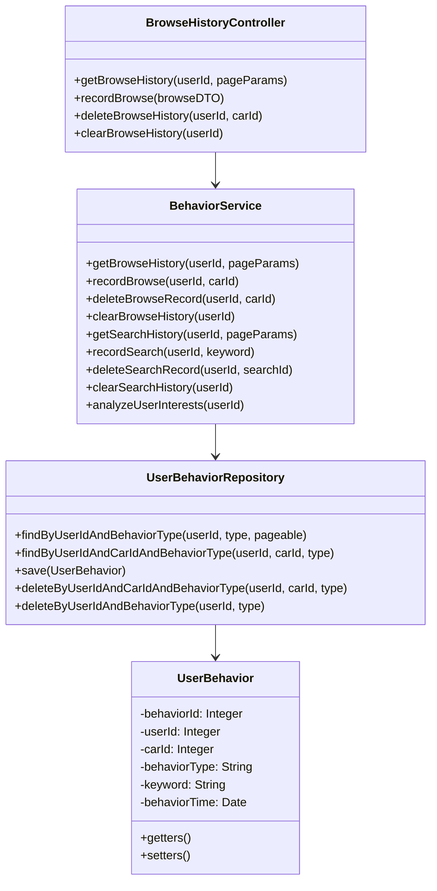
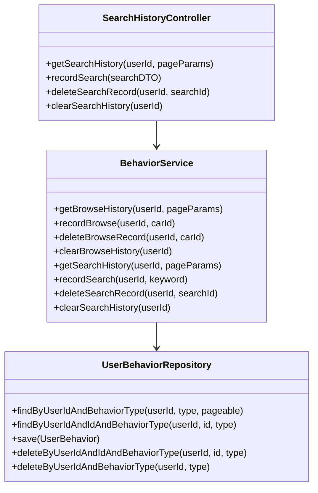
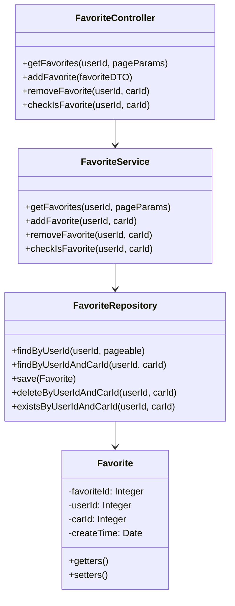
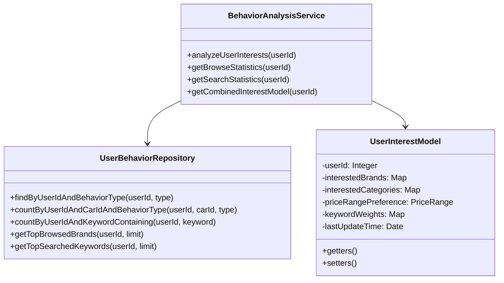

## 行为记录模块

### 1. 简介

行为记录模块负责追踪和管理用户在系统中的各种行为，包括浏览记录、搜索记录和交互操作等。这些数据一方面为用户提供个人历史记录服务，另一方面也为推荐引擎提供用户兴趣特征分析的基础数据。

### 2. 功能列表

| 序号 | 功能名称 | 功能描述 |
|------|----------|----------|
| 1    | 浏览记录管理 | 记录和查询用户的车辆浏览历史 |
| 2    | 搜索记录管理 | 记录和查询用户的搜索关键词历史 |
| 3    | 收藏管理 | 用户收藏车辆和管理收藏列表 |
| 4    | 行为数据分析 | 分析用户行为数据，识别兴趣模式 |

### 3. 子功能设计

#### 3.1 浏览记录管理

##### 1) 功能设计描述

浏览记录管理子功能负责记录用户浏览过的车辆，并提供查询和清除历史记录的功能。

###### (1) 类

- **BrowseHistoryController**
  
  处理浏览记录相关HTTP请求的控制器类。

- **BehaviorService**
  
  实现用户行为管理业务逻辑的服务类。

- **UserBehaviorRepository**
  
  负责用户行为数据持久化操作的数据访问层。

- **UserBehavior**
  
  用户行为记录实体类，对应数据库UserBehaviors表。

###### (2) 类与类之间关系



###### (3) 文件列表

| 名称 | 类型 | 存放位置 | 说明 |
|------|------|----------|------|
| BrowseHistoryController.java | 类 | controller/behavior | 浏览记录控制器 |
| BehaviorService.java | 接口 | service | 行为服务接口 |
| BehaviorServiceImpl.java | 类 | service/impl | 行为服务实现 |
| UserBehaviorRepository.java | 接口 | repository | 用户行为数据访问接口 |
| UserBehavior.java | 类 | entity | 用户行为实体类 |
| BrowseHistoryDTO.java | 类 | dto | 浏览历史数据传输对象 |
| RecordBrowseDTO.java | 类 | dto | 记录浏览行为数据传输对象 |

##### 2) 功能实现说明

###### 记录浏览历史流程

```mermaid
sequenceDiagram
    参与者 Client
    参与者 BrowseHistoryController
    参与者 BehaviorService
    参与者 UserBehaviorRepository
    参与者 Database
    
    Client->>BrowseHistoryController: 请求记录浏览行为
    BrowseHistoryController->>BehaviorService: 调用recordBrowse(userId, carId)
    BehaviorService->>UserBehaviorRepository: 检查是否有已存在记录
    UserBehaviorRepository->>Database: 查询数据库
    Database-->>UserBehaviorRepository: 返回查询结果
    UserBehaviorRepository-->>BehaviorService: 返回查询结果
    
    alt 已存在浏览记录
        BehaviorService->>UserBehaviorRepository: 更新浏览时间
    else 不存在浏览记录
        BehaviorService->>UserBehaviorRepository: 创建新浏览记录
    end
    
    UserBehaviorRepository->>Database: 保存数据
    Database-->>UserBehaviorRepository: 返回操作结果
    UserBehaviorRepository-->>BehaviorService: 返回操作结果
    BehaviorService-->>BrowseHistoryController: 返回保存结果
    BrowseHistoryController-->>Client: 返回操作成功响应
```

###### 查询浏览历史流程

```mermaid
sequenceDiagram
    参与者 Client
    参与者 BrowseHistoryController
    参与者 BehaviorService
    参与者 UserBehaviorRepository
    参与者 Database
    
    Client->>BrowseHistoryController: 请求获取浏览历史
    BrowseHistoryController->>BehaviorService: 调用getBrowseHistory(userId, pageParams)
    BehaviorService->>UserBehaviorRepository: 查询浏览记录
    UserBehaviorRepository->>Database: 查询数据库
    Database-->>UserBehaviorRepository: 返回浏览记录数据
    UserBehaviorRepository-->>BehaviorService: 返回浏览记录列表
    BehaviorService-->>BrowseHistoryController: 返回浏览历史和分页信息
    BrowseHistoryController-->>Client: 返回浏览历史响应
```

#### 3.2 搜索记录管理

##### 1) 功能设计描述

搜索记录管理子功能负责记录用户的搜索关键词，并提供查询和清除搜索历史的功能。

###### (1) 类

- **SearchHistoryController**
  
  处理搜索记录相关HTTP请求的控制器类。

- **BehaviorService**
  
  实现用户行为管理业务逻辑的服务类，与浏览记录管理共用。

- **UserBehaviorRepository**
  
  负责用户行为数据持久化操作的数据访问层，与浏览记录管理共用。

###### (2) 类与类之间关系



###### (3) 文件列表

| 名称 | 类型 | 存放位置 | 说明 |
|------|------|----------|------|
| SearchHistoryController.java | 类 | controller/behavior | 搜索记录控制器 |
| SearchHistoryDTO.java | 类 | dto | 搜索历史数据传输对象 |
| RecordSearchDTO.java | 类 | dto | 记录搜索行为数据传输对象 |

##### 2) 功能实现说明

###### 记录搜索关键词流程

```mermaid
sequenceDiagram
    参与者 Client
    参与者 SearchHistoryController
    参与者 BehaviorService
    参与者 UserBehaviorRepository
    参与者 Database
    
    Client->>SearchHistoryController: 请求记录搜索关键词
    SearchHistoryController->>BehaviorService: 调用recordSearch(userId, keyword)
    BehaviorService->>UserBehaviorRepository: 创建搜索记录
    UserBehaviorRepository->>Database: 保存数据
    Database-->>UserBehaviorRepository: 返回操作结果
    UserBehaviorRepository-->>BehaviorService: 返回操作结果
    BehaviorService-->>SearchHistoryController: 返回保存结果
    SearchHistoryController-->>Client: 返回操作成功响应
```

#### 3.3 收藏管理

##### 1) 功能设计描述

收藏管理子功能负责用户收藏和取消收藏车辆，以及查看收藏列表。

###### (1) 类

- **FavoriteController**
  
  处理收藏相关HTTP请求的控制器类。

- **FavoriteService**
  
  实现收藏管理业务逻辑的服务类。

- **FavoriteRepository**
  
  负责收藏数据持久化操作的数据访问层。

- **Favorite**
  
  收藏记录实体类，对应数据库Favorites表。

###### (2) 类与类之间关系



###### (3) 文件列表

| 名称 | 类型 | 存放位置 | 说明 |
|------|------|----------|------|
| FavoriteController.java | 类 | controller/behavior | 收藏控制器 |
| FavoriteService.java | 接口 | service | 收藏服务接口 |
| FavoriteServiceImpl.java | 类 | service/impl | 收藏服务实现 |
| FavoriteRepository.java | 接口 | repository | 收藏数据访问接口 |
| Favorite.java | 类 | entity | 收藏实体类 |
| FavoriteDTO.java | 类 | dto | 收藏数据传输对象 |

##### 2) 功能实现说明

###### 添加收藏流程

```mermaid
sequenceDiagram
    参与者 Client
    参与者 FavoriteController
    参与者 FavoriteService
    参与者 FavoriteRepository
    参与者 Database
    
    Client->>FavoriteController: 请求收藏车辆
    FavoriteController->>FavoriteService: 调用addFavorite(userId, carId)
    FavoriteService->>FavoriteRepository: 检查是否已收藏
    FavoriteRepository->>Database: 查询数据库
    Database-->>FavoriteRepository: 返回查询结果
    FavoriteRepository-->>FavoriteService: 返回查询结果
    
    alt 已收藏
        FavoriteService-->>FavoriteController: 返回已收藏信息
        FavoriteController-->>Client: 返回已收藏响应
    else 未收藏
        FavoriteService->>FavoriteRepository: 创建收藏记录
        FavoriteRepository->>Database: 保存数据
        Database-->>FavoriteRepository: 返回操作结果
        FavoriteRepository-->>FavoriteService: 返回操作结果
        FavoriteService-->>FavoriteController: 返回收藏成功
        FavoriteController-->>Client: 返回收藏成功响应
    end
```

#### 3.4 行为数据分析

##### 1) 功能设计描述

行为数据分析子功能负责对用户行为数据进行统计和分析，为推荐引擎提供数据支持。

###### (1) 类

- **BehaviorAnalysisService**
  
  实现用户行为分析业务逻辑的服务类。

- **UserInterestModel**
  
  用户兴趣模型类，表示用户偏好的各项特征。

###### (2) 类与类之间关系



###### (3) 文件列表

| 名称 | 类型 | 存放位置 | 说明 |
|------|------|----------|------|
| BehaviorAnalysisService.java | 接口 | service | 行为分析服务接口 |
| BehaviorAnalysisServiceImpl.java | 类 | service/impl | 行为分析服务实现 |
| UserInterestModel.java | 类 | model | 用户兴趣模型类 |
| PriceRange.java | 类 | model | 价格区间模型类 |
| InterestWeight.java | 类 | model | 兴趣权重枚举 |

##### 2) 功能实现说明

###### 用户兴趣分析流程

```mermaid
sequenceDiagram
    参与者 RecommendationEngine
    参与者 BehaviorAnalysisService
    参与者 UserBehaviorRepository
    参与者 Database
    
    RecommendationEngine->>BehaviorAnalysisService: 请求分析用户兴趣
    BehaviorAnalysisService->>UserBehaviorRepository: 获取用户浏览记录
    UserBehaviorRepository->>Database: 查询数据库
    Database-->>UserBehaviorRepository: 返回浏览记录
    UserBehaviorRepository-->>BehaviorAnalysisService: 返回浏览记录数据
    
    BehaviorAnalysisService->>UserBehaviorRepository: 获取用户搜索记录
    UserBehaviorRepository->>Database: 查询数据库
    Database-->>UserBehaviorRepository: 返回搜索记录
    UserBehaviorRepository-->>BehaviorAnalysisService: 返回搜索记录数据
    
    BehaviorAnalysisService->>BehaviorAnalysisService: 分析浏览偏好
    BehaviorAnalysisService->>BehaviorAnalysisService: 分析搜索偏好
    BehaviorAnalysisService->>BehaviorAnalysisService: 合并偏好模型
    
    BehaviorAnalysisService-->>RecommendationEngine: 返回用户兴趣模型
```
