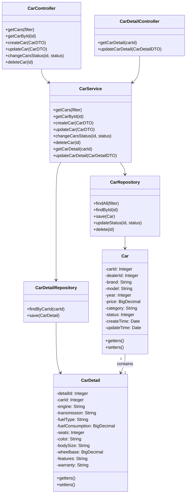
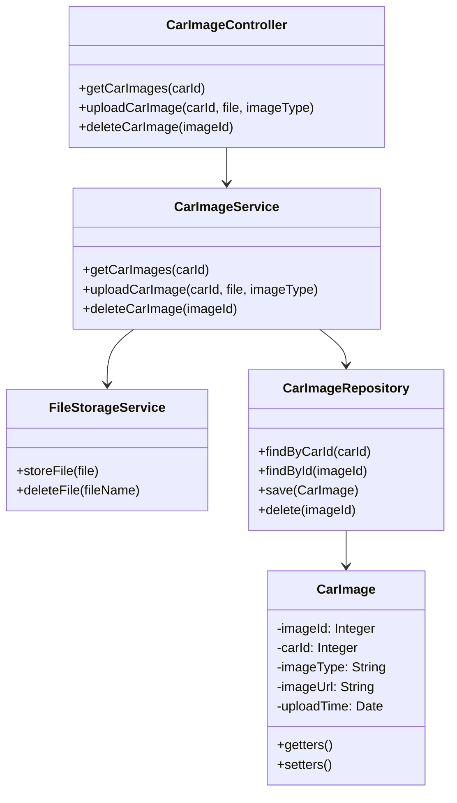
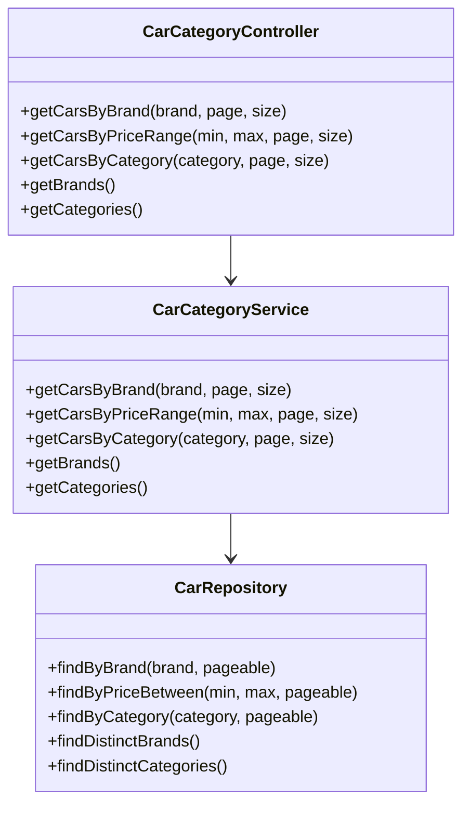
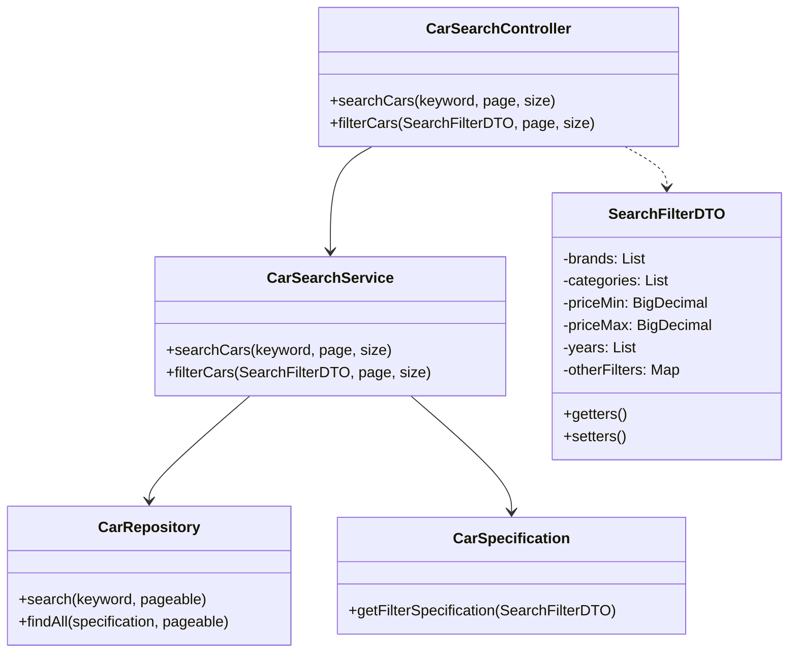

## 车辆模块

### 1. 简介

车辆模块是系统的核心业务模块，负责车辆信息的录入、管理、展示和搜索。经销商通过该模块上传和管理车辆信息，普通用户通过该模块浏览、筛选和查看车辆详情。

### 2. 功能列表

| 序号 | 功能名称 | 功能描述 |
|------|----------|----------|
| 1    | 车辆信息管理 | 车辆基本信息和详细参数的录入、编辑、上架下架 |
| 2    | 车辆图片管理 | 车辆图片的上传和管理 |
| 3    | 车辆分类展示 | 按品牌、价格、类型等分类展示车辆 |
| 4    | 车辆搜索筛选 | 支持关键词搜索和多条件筛选车辆 |

### 3. 子功能设计

#### 3.1 车辆信息管理

##### 1) 功能设计描述

车辆信息管理子功能负责车辆基本信息和详细参数的录入、编辑、查询和上下架管理。

###### (1) 类

- **CarController**
  
  处理车辆基本信息相关HTTP请求的控制器类。

- **CarDetailController**
  
  处理车辆详细参数相关HTTP请求的控制器类。

- **CarService**
  
  实现车辆信息管理业务逻辑的服务类。

- **CarRepository**
  
  负责车辆基本信息的数据持久化操作。

- **CarDetailRepository**
  
  负责车辆详细参数的数据持久化操作。

- **Car**
  
  车辆基本信息实体类，对应数据库Cars表。

- **CarDetail**
  
  车辆详细参数实体类，对应数据库CarDetails表。

###### (2) 类与类之间关系



###### (3) 文件列表

| 名称 | 类型 | 存放位置 | 说明 |
|------|------|----------|------|
| CarController.java | 类 | controller/car | 车辆控制器 |
| CarDetailController.java | 类 | controller/car | 车辆详情控制器 |
| CarService.java | 接口 | service | 车辆服务接口 |
| CarServiceImpl.java | 类 | service/impl | 车辆服务实现 |
| CarRepository.java | 接口 | repository | 车辆数据访问接口 |
| CarDetailRepository.java | 接口 | repository | 车辆详情数据访问接口 |
| Car.java | 类 | entity | 车辆实体类 |
| CarDetail.java | 类 | entity | 车辆详情实体类 |
| CarDTO.java | 类 | dto | 车辆数据传输对象 |
| CarDetailDTO.java | 类 | dto | 车辆详情数据传输对象 |
| CarFilter.java | 类 | dto | 车辆筛选条件对象 |

##### 2) 功能实现说明

###### 车辆创建流程

```mermaid
sequenceDiagram
    参与者 DealerClient
    参与者 CarController
    参与者 CarService
    参与者 CarRepository
    参与者 CarDetailRepository
    参与者 Database
    
    DealerClient->>CarController: 提交车辆基本信息
    CarController->>CarService: 调用createCar(carDTO)
    CarService->>CarService: 验证数据
    CarService->>CarService: 设置初始状态和时间
    CarService->>CarRepository: 保存车辆基本信息
    CarRepository->>Database: 插入数据
    Database-->>CarRepository: 返回车辆ID
    CarRepository-->>CarService: 返回车辆实体
    
    alt 包含详细参数
        CarService->>CarDetailRepository: 保存车辆详细参数
        CarDetailRepository->>Database: 插入数据
        Database-->>CarDetailRepository: 操作结果
        CarDetailRepository-->>CarService: 操作结果
    end
    
    CarService-->>CarController: 返回创建结果
    CarController-->>DealerClient: 返回创建成功响应
```

###### 车辆上下架流程

```mermaid
sequenceDiagram
    参与者 DealerClient
    参与者 CarController
    参与者 CarService
    参与者 CarRepository
    参与者 Database
    
    DealerClient->>CarController: 请求车辆上架/下架
    CarController->>CarService: 调用changeCarsStatus(id, status)
    CarService->>CarRepository: 查询车辆是否存在
    CarRepository->>Database: 查询数据库
    Database-->>CarRepository: 返回车辆数据
    CarRepository-->>CarService: 返回车辆实体
    
    alt 车辆存在
        CarService->>CarService: 验证状态变更权限
        CarService->>CarRepository: 更新车辆状态
        CarRepository->>Database: 更新数据
        Database-->>CarRepository: 操作结果
        CarRepository-->>CarService: 操作结果
        CarService-->>CarController: 返回状态变更结果
        CarController-->>DealerClient: 返回成功响应
    else 车辆不存在
        CarService-->>CarController: 返回车辆不存在错误
        CarController-->>DealerClient: 返回错误响应
    end
```

#### 3.2 车辆图片管理

##### 1) 功能设计描述

车辆图片管理子功能负责车辆图片的上传、查询、删除和管理。

###### (1) 类

- **CarImageController**
  
  处理车辆图片相关HTTP请求的控制器类。

- **CarImageService**
  
  实现车辆图片管理业务逻辑的服务类。

- **FileStorageService**
  
  处理文件上传和存储的服务类。

- **CarImageRepository**
  
  负责车辆图片数据的持久化操作。

- **CarImage**
  
  车辆图片实体类，对应数据库CarImages表。

###### (2) 类与类之间关系



###### (3) 文件列表

| 名称 | 类型 | 存放位置 | 说明 |
|------|------|----------|------|
| CarImageController.java | 类 | controller/car | 车辆图片控制器 |
| CarImageService.java | 接口 | service | 车辆图片服务接口 |
| CarImageServiceImpl.java | 类 | service/impl | 车辆图片服务实现 |
| FileStorageService.java | 接口 | service | 文件存储服务接口 |
| FileStorageServiceImpl.java | 类 | service/impl | 文件存储服务实现 |
| CarImageRepository.java | 接口 | repository | 车辆图片数据访问接口 |
| CarImage.java | 类 | entity | 车辆图片实体类 |
| CarImageDTO.java | 类 | dto | 车辆图片数据传输对象 |

##### 2) 功能实现说明

###### 图片上传流程

```mermaid
sequenceDiagram
    参与者 DealerClient
    参与者 CarImageController
    参与者 CarImageService
    参与者 FileStorageService
    参与者 CarImageRepository
    参与者 Database
    参与者 FileStorage
    
    DealerClient->>CarImageController: 上传车辆图片
    CarImageController->>CarImageService: 调用uploadCarImage(carId, file, imageType)
    
    CarImageService->>FileStorageService: 保存图片文件
    FileStorageService->>FileStorage: 存储文件
    FileStorage-->>FileStorageService: 返回文件URL
    FileStorageService-->>CarImageService: 返回文件URL
    
    CarImageService->>CarImageRepository: 保存图片信息
    CarImageRepository->>Database: 插入数据
    Database-->>CarImageRepository: 操作结果
    CarImageRepository-->>CarImageService: 操作结果
    
    CarImageService-->>CarImageController: 返回上传结果
    CarImageController-->>DealerClient: 返回上传成功响应
```

#### 3.3 车辆分类展示

##### 1) 功能设计描述

车辆分类展示子功能负责按不同分类方式展示车辆列表，包括按品牌、价格区间、车型类别等分类。

###### (1) 类

- **CarCategoryController**
  
  处理车辆分类展示相关HTTP请求的控制器类。

- **CarCategoryService**
  
  实现车辆分类展示业务逻辑的服务类。

###### (2) 类与类之间关系



###### (3) 文件列表

| 名称 | 类型 | 存放位置 | 说明 |
|------|------|----------|------|
| CarCategoryController.java | 类 | controller/car | 车辆分类控制器 |
| CarCategoryService.java | 接口 | service | 车辆分类服务接口 |
| CarCategoryServiceImpl.java | 类 | service/impl | 车辆分类服务实现 |
| CategoryDTO.java | 类 | dto | 分类数据传输对象 |
| PageDTO.java | 类 | dto | 分页数据传输对象 |

##### 2) 功能实现说明

###### 品牌分类查询流程

```mermaid
sequenceDiagram
    参与者 Client
    参与者 CarCategoryController
    参与者 CarCategoryService
    参与者 CarRepository
    参与者 Database
    
    Client->>CarCategoryController: 请求指定品牌的车辆列表
    CarCategoryController->>CarCategoryService: 调用getCarsByBrand(brand, page, size)
    CarCategoryService->>CarRepository: 查询符合条件的车辆
    CarRepository->>Database: 查询数据库
    Database-->>CarRepository: 返回车辆数据
    CarRepository-->>CarCategoryService: 返回车辆列表和分页信息
    CarCategoryService-->>CarCategoryController: 返回车辆列表和分页信息
    CarCategoryController-->>Client: 返回车辆列表响应
```

#### 3.4 车辆搜索筛选

##### 1) 功能设计描述

车辆搜索筛选子功能负责支持用户通过关键词搜索和多条件组合筛选车辆。

###### (1) 类

- **CarSearchController**
  
  处理车辆搜索筛选相关HTTP请求的控制器类。

- **CarSearchService**
  
  实现车辆搜索筛选业务逻辑的服务类。

- **CarSpecification**
  
  车辆查询条件规范构建类。

###### (2) 类与类之间关系



###### (3) 文件列表

| 名称 | 类型 | 存放位置 | 说明 |
|------|------|----------|------|
| CarSearchController.java | 类 | controller/car | 车辆搜索控制器 |
| CarSearchService.java | 接口 | service | 车辆搜索服务接口 |
| CarSearchServiceImpl.java | 类 | service/impl | 车辆搜索服务实现 |
| CarSpecification.java | 类 | repository/spec | 车辆查询规范 |
| SearchFilterDTO.java | 类 | dto | 搜索筛选条件数据传输对象 |

##### 2) 功能实现说明

###### 多条件筛选流程

```mermaid
sequenceDiagram
    参与者 Client
    参与者 CarSearchController
    参与者 CarSearchService
    参与者 CarSpecification
    参与者 CarRepository
    参与者 Database
    
    Client->>CarSearchController: 提交筛选条件
    CarSearchController->>CarSearchService: 调用filterCars(filterDTO, page, size)
    CarSearchService->>CarSpecification: 构建查询规范
    CarSpecification-->>CarSearchService: 返回规范对象
    CarSearchService->>CarRepository: 查询符合条件的车辆
    CarRepository->>Database: 查询数据库
    Database-->>CarRepository: 返回车辆数据
    CarRepository-->>CarSearchService: 返回筛选结果
    CarSearchService-->>CarSearchController: 返回筛选结果和分页信息
    CarSearchController-->>Client: 返回筛选结果响应
```
