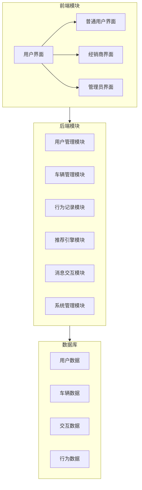

### 项目名称

基于Java的汽车推荐购买平台

智选车

Java、智能推荐、详情展示、交互沟通

### 项目要求

用户管理：支持注册登录，完善资料并设置购车偏好。

车辆管理：管理员录入车辆信息，分类并更新数据。

行为记录：记录用户浏览、收藏、咨询车辆的行为。

智能推荐：依据偏好和行为，用算法推荐合适汽车。

详情展示：展示推荐车辆详情，含参数、价格、图片等。

交互沟通：用户与经销商在线沟通，预约看车试驾。

反馈优化：收集用户反馈，优化推荐算法。

### 项目边界

1. 用户范围
- 普通用户：购车用户
- 经销商用户：提供车辆和服务
- 管理员：系统维护和数据管理

2. 功能边界
- 仅提供新车推荐和购买服务
- 不涉及二手车交易
- 不提供支付功能，仅支持预约
- 仅支持国内市场车型

3. 技术边界
- 基于Java Web技术栈开发
- 使用关系型数据库存储
- 支持Web端访问
- 不开发移动端APP

# 智选车 - 汽车推荐购买平台总体模块设计

## 系统架构图

## 核心模块说明

### 1. 用户管理模块
- 负责：用户注册、登录、信息管理、权限控制
- 功能：
  - 用户认证：处理登录、注册、密码找回
  - 用户信息：管理个人资料、购车偏好设置
  - 权限管理：控制不同用户类型的访问权限

### 2. 车辆管理模块
- 负责：车辆信息的录入、查询、分类与展示
- 功能：
  - 车辆录入：经销商或管理员添加新车型
  - 车辆分类：按品牌、价格、类型等进行分类
  - 车辆查询：基础和高级搜索功能

### 3. 行为记录模块
- 负责：记录用户浏览、收藏、咨询等行为
- 功能：
  - 浏览记录：记录用户查看的车辆
  - 收藏管理：用户收藏喜欢的车辆
  - 行为分析：分析用户兴趣点

### 4. 推荐引擎模块
- 负责：基于用户偏好和行为推荐车辆
- 功能：
  - 偏好匹配：根据用户设置的偏好推荐
  - 行为分析：根据浏览和收藏历史推荐
  - 热门推荐：推荐热门或新上市车型

### 5. 消息交互模块
- 负责：用户与经销商沟通、预约服务
- 功能：
  - 在线咨询：即时消息交流
  - 预约管理：试驾和看车预约
  - 通知提醒：系统消息和提醒

### 6. 系统管理模块
- 负责：管理员维护系统和数据
- 功能：
  - 用户管理：管理所有用户账号
  - 内容审核：审核车辆信息和评论
  - 数据统计：系统运行数据分析

no
# Interface Description接口描述
本节描述软件系统中设计实体(如子系统，模块，进程)的接口.
对于外部实体只有同被描述软件相关的接口才需描述。
接口可以是函数调用、事件、消息、信号等。