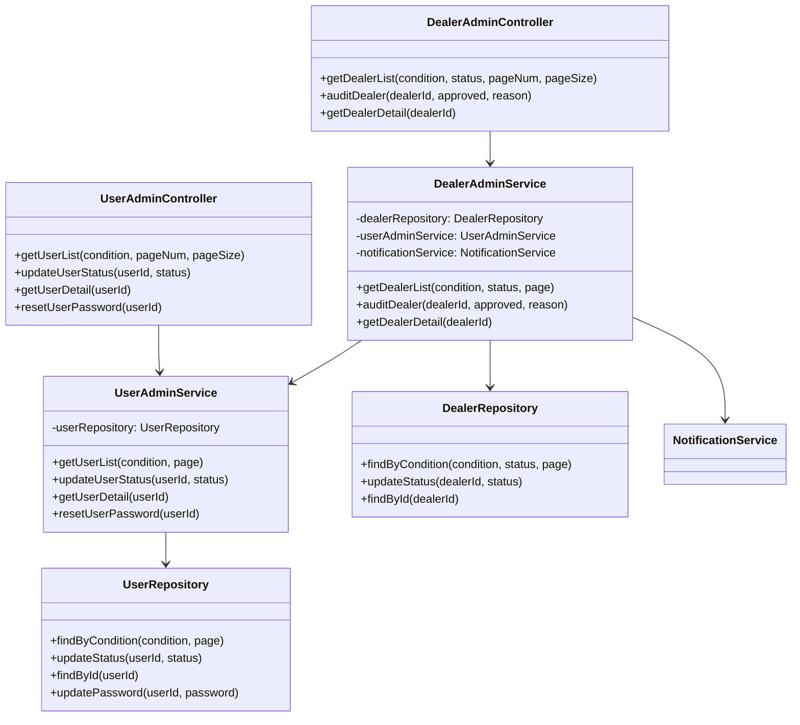
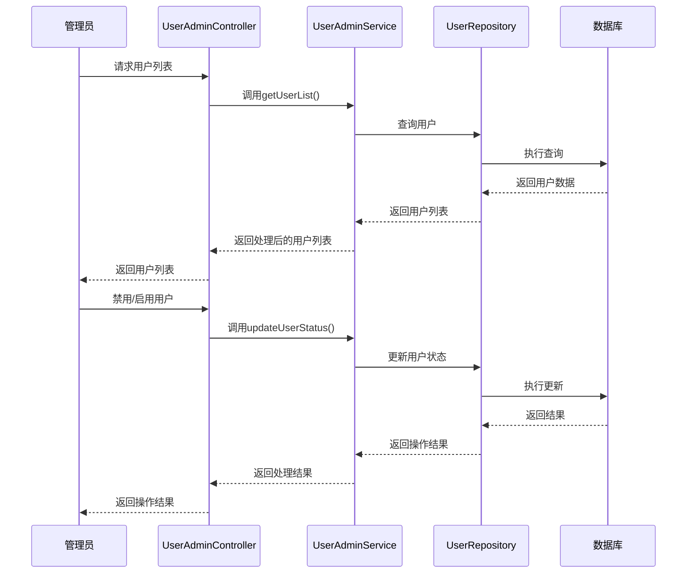
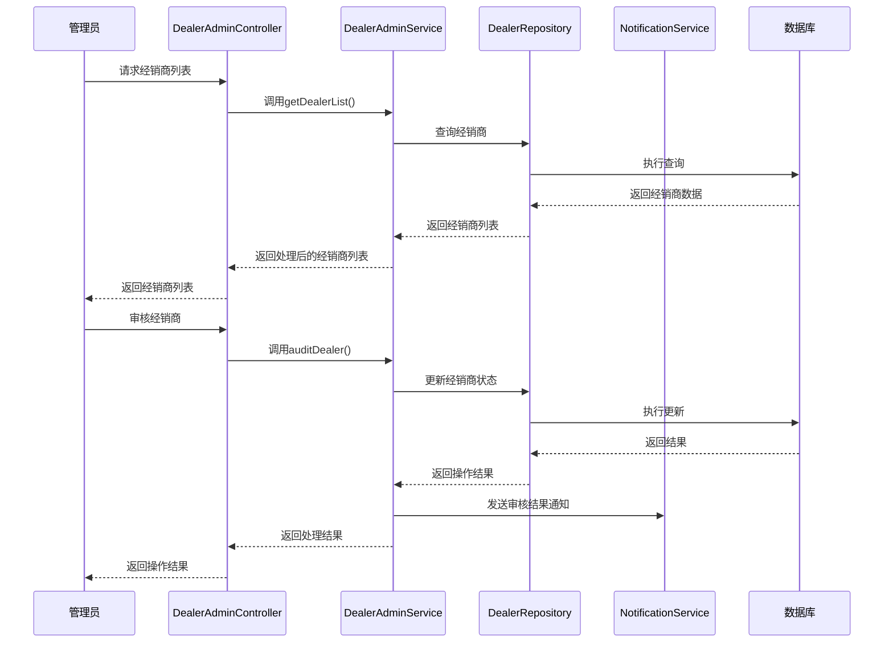
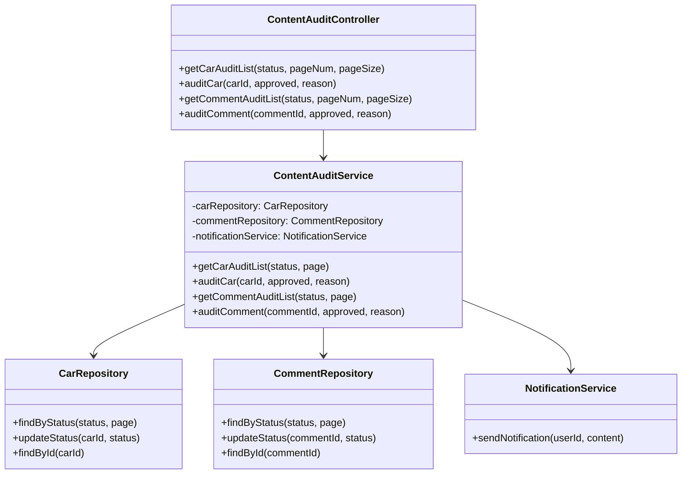
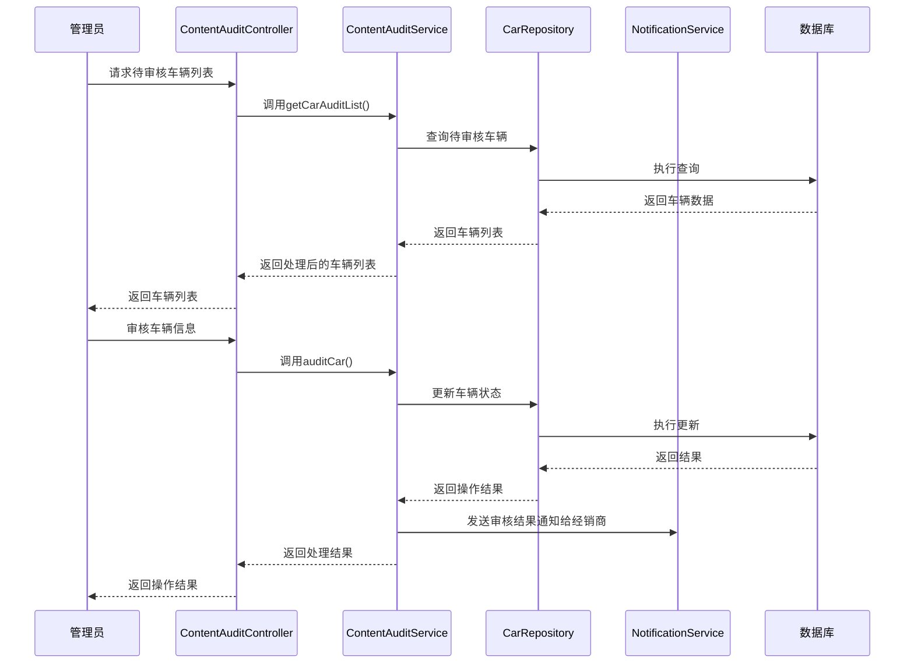
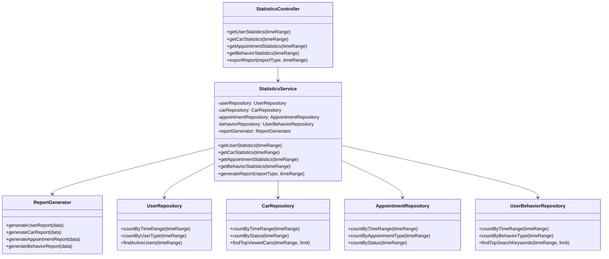
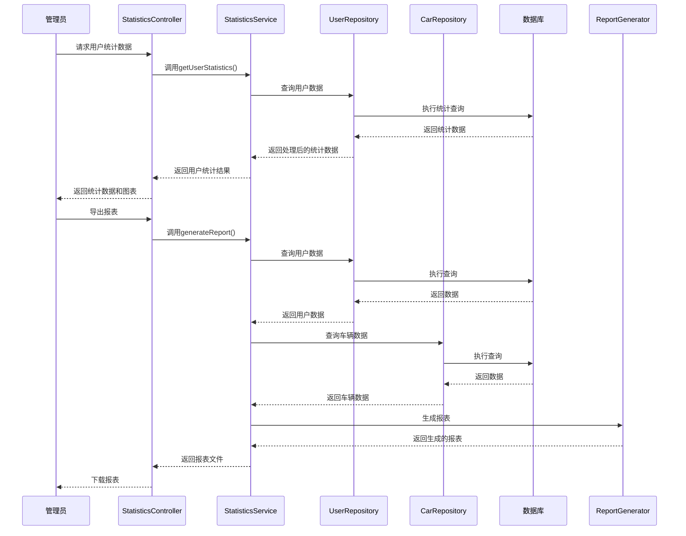

#### 系统管理模块
1、简介

系统管理模块是智选车平台的后台管理核心，主要负责平台的用户管理、内容审核和数据统计等功能。该模块为管理员提供完整的平台运营工具，确保平台数据的准确性、安全性和平台的健康运行。

2、功能列表

|序号|功能名称|功能描述|
|---|---|---|
|1|用户管理|管理所有用户账号，包括普通用户和经销商的审核、启用和禁用|
|2|内容审核|审核车辆信息和用户评论，确保内容合规|
|3|数据统计|收集和分析系统运行数据，生成运营报表|

##### 用户管理
1 功能设计描述

用户管理功能允许管理员查看、审核和管理所有用户账号，包括普通用户和经销商账号的状态控制。

（1）类

- UserAdminService

负责用户管理的业务逻辑，包括用户查询、状态修改、经销商审核等功能。

- DealerAdminService

专门负责经销商相关的管理功能，包括经销商资质审核等。

- UserAdminController

处理用户管理相关的HTTP请求，向前端提供用户管理接口。

- DealerAdminController

处理经销商管理相关的HTTP请求，向前端提供经销商管理接口。

（2）类与类之间关系

（3）文件列表

|名称|类型|存放位置|说明|
|---|---|---|---|
|UserAdminController.java|控制器|src/main/java/com/smartcar/controller/admin|用户管理控制器|
|DealerAdminController.java|控制器|src/main/java/com/smartcar/controller/admin|经销商管理控制器|
|UserAdminService.java|服务|src/main/java/com/smartcar/service/admin|用户管理服务|
|UserAdminServiceImpl.java|服务实现|src/main/java/com/smartcar/service/admin/impl|用户管理服务实现|
|DealerAdminService.java|服务|src/main/java/com/smartcar/service/admin|经销商管理服务|
|DealerAdminServiceImpl.java|服务实现|src/main/java/com/smartcar/service/admin/impl|经销商管理服务实现|

2 功能实现说明

##### 内容审核
1 功能设计描述

内容审核功能允许管理员审核车辆信息和用户评论，确保平台内容的合规性和质量。

（1）类

- ContentAuditService

负责内容审核的业务逻辑，包括车辆信息审核、评论审核等功能。

- ContentAuditController

处理内容审核相关的HTTP请求，向前端提供内容审核接口。

（2）类与类之间关系

（3）文件列表

|名称|类型|存放位置|说明|
|---|---|---|---|
|ContentAuditController.java|控制器|src/main/java/com/smartcar/controller/admin|内容审核控制器|
|ContentAuditService.java|服务|src/main/java/com/smartcar/service/admin|内容审核服务|
|ContentAuditServiceImpl.java|服务实现|src/main/java/com/smartcar/service/admin/impl|内容审核服务实现|

2 功能实现说明

##### 数据统计
1 功能设计描述

数据统计功能收集和分析系统运行数据，包括用户数据、交易数据、行为数据等，生成相应的运营报表。

（1）类

- StatisticsService

负责数据统计的业务逻辑，包括各类数据的统计和分析。

- StatisticsController

处理数据统计相关的HTTP请求，向前端提供数据统计接口。

- ReportGenerator

报表生成器，负责生成各类报表。

（2）类与类之间关系

（3）文件列表

|名称|类型|存放位置|说明|
|---|---|---|---|
|StatisticsController.java|控制器|src/main/java/com/smartcar/controller/admin|数据统计控制器|
|StatisticsService.java|服务|src/main/java/com/smartcar/service/admin|数据统计服务|
|StatisticsServiceImpl.java|服务实现|src/main/java/com/smartcar/service/admin/impl|数据统计服务实现|
|ReportGenerator.java|工具类|src/main/java/com/smartcar/util|报表生成器|

2 功能实现说明

